# Gurukul Master AI Architecture Specification

**Document class:** Company architecture authority  
**Owner:** Chief AI Architect  
**Status:** Baseline specification for implementation (strengthened — Educational Intelligence + enterprise AI control plane)  
**Intended readers:** Founders, CTO, engineering leads, data platform team, product leaders, security reviewers, and future implementation agents  
**Scope:** Gurukul's company-wide AI infrastructure for school ERP and academic intelligence  
**Revision rule:** Changes to the non-negotiable rules in this document require CTO and AI Architecture approval.  
**SSOT path:** This file is the source of truth; do not diverge copies without ADR.

---

## 1. Executive mandate

Gurukul is a School ERP and Academic Intelligence Platform. Its advantage is not a generic language model. Its durable, proprietary advantage is the **Educational Intelligence Engine**: a deterministic computation layer that continuously transforms Academic Engine ERP records into structured educational intelligence—concept mastery, revision priority, forgetting curves, learning velocity, mistake clusters, exam readiness, attendance risk, battleground performance, class patterns, and school academic health—**before any LLM sees the data**.

The Academic Engine remains the system of record for attendance, homework, assignments, tests, exams, marks, question attempts, mistake history, revision activity, practice, battleground performance, teacher remarks, parent interactions, notifications, and school analytics. The Educational Intelligence Engine is the system of educational insight derived from that record. The AI system (Router, Context Builder, prompts, and Qwen) exists to explain, personalise presentation, and generate bounded artifacts from those trusted intelligence outputs—never to invent or recalculate them.

The primary reasoning model is **Qwen**, accessed through **OpenRouter**. This is an implementation choice, not a dependency. Gurukul must own the Educational Intelligence Engine, routing, permissions, context, prompts, memory, knowledge lifecycle, workflow orchestration, audit trail, and fallbacks. No application feature may call OpenRouter, Qwen, a vector database, or another model provider directly.

This document is the architectural contract for that system. It defines what future services, Cursor prompts, engineers, and vendors are allowed to build.

### 1.1 North-star outcome

For every user request, Gurukul should use the lowest-cost, highest-trust method that can answer correctly:

1. A deterministic ERP or Academic Engine answer.
2. A precomputed Educational Intelligence insight or safe cached answer.
3. Grounded retrieval from approved school knowledge (managed by the Knowledge Management Service).
4. A carefully bounded Qwen call with the minimum useful context, adaptive reasoning budget, and validated confidence.

The system must never use an LLM merely because an LLM is available. **Deterministic-first, intelligence-first, cache-first, retrieval-first, model-last** is the permanent order of operations.

### 1.2 Architectural principles

| Principle | Mandatory interpretation |
|---|---|
| Academic data first | Academic Engine outputs are the source of record truth. Educational Intelligence Engine outputs are the source of computed educational insight. LLMs explain and transform; they do not calculate mastery, decide permissions, or invent records. |
| Educational intelligence before generation | Structured educational metrics are precomputed continuously; generative AI consumes intelligence products, never raw ERP tables. |
| Router sovereignty | Every AI request enters the Gurukul AI Gateway and AI Router (or Workflow Orchestrator for multi-step pipelines that then call the Router). Direct provider access is prohibited. |
| Deterministic before generative | Structured data, Educational Intelligence, rules, templates, and cache precede vector search and model calls. |
| Least context | Send only the smallest authorised, task-relevant context necessary to answer. |
| Least privilege | Identity, tenant, role, relationship, and purpose are checked before context assembly and again before response delivery. |
| Explainable routing | Every response has a traceable route, evidence set, policy decision, cost, reasoning budget, and confidence record. |
| Privacy by default | Student data is isolated by school and role; unnecessary PII never reaches a provider. |
| Provider independence | Models are selected by internal capability and policy, never by application code. |
| Cost is a product feature | Usage is governed per task, user, school, reasoning budget tier, and provider rate card. |
| Safe failure | If trusted context, permissions, or validation is unavailable, the system declines, narrows, queues, recovers, or escalates; it does not guess. |
| Feedback improves the system | Teacher edits, student retries, accept/reject signals, and corrections feed quality, prompt, cache, and routing improvement—not unrestricted model fine-tuning on minors’ raw chat. |

### 1.3 Non-goals

This platform is not:

- a general-purpose public chatbot;
- an autonomous agent that changes attendance, marks, homework, fees, or school records;
- a replacement for teacher judgement, school policy, safeguarding procedures, or examination controls;
- a system that lets a model query ERP tables or browse internal data freely;
- a place to store unrestricted student conversations or unbounded long-term memory;
- an immediate multi-agent product (agent roles are reserved architecturally; see Future Multi-Agent Architecture);
- a system where an LLM computes concept mastery, rankings, attendance risk, or exam readiness.

---

## 2. Business constraints and service objectives

### 2.1 Initial operating envelope

| Dimension | Baseline |
|---|---|
| School size | 750-1,000 students per school |
| User groups | Students, teachers, parents, principals, school administrators |
| Primary model | Qwen via OpenRouter |
| Monthly AI budget | Target: INR 2,000-3,000 per school; hard operating guardrail: INR 5,000 per school unless an approved contract changes it |
| Data source | Academic Engine structured context, not raw-table model access |
| Availability target | Core deterministic AI answers: 99.9%; model-backed experiences: 99.5% monthly service availability |
| Router latency target | Policy/routing decision p95 under 250 ms, excluding retrieval and model generation |
| Safety expectation | No cross-school leakage; no unauthorised student disclosure; no ungrounded academic record claims |

### 2.2 Service-level objectives

| Path | p95 target | Success condition |
|---|---:|---|
| Deterministic data answer | 1.5 s | Authorised Academic Engine response rendered correctly |
| Exact solution-cache hit | 800 ms | Valid cache entry, current data version, permission-compatible |
| Vector-grounded answer | 4 s | Retrieved evidence passes relevance and access checks |
| Standard Qwen answer | 10 s | Validated response with grounded citations where required |
| Image doubt | 15 s | Image safety/OCR route plus validated academic response |
| Voice doubt | 15 s | Speech transcription plus validated academic response |
| Teacher document generation | 20 s interactive / asynchronous for larger packs | Generated artifact passes policy and quality checks |

The router may offer asynchronous delivery for work that cannot meet interactive targets. It must disclose that the work is being prepared and never pretend a background job has completed.

### 2.3 Cost objective translated into design rules

At INR 3,000 per month, an average school has roughly INR 100 per day for all AI activity. Gurukul therefore treats model inference as a limited premium resource.

The architecture must achieve all of the following before broad rollout:

- At least 60% of eligible high-volume requests answered without a generative model.
- At least 25% of repeated educational questions served from a permission-safe cache or precomputed educational artifact after adoption matures.
- Personalised learning, parent, teacher, and principal insights prefer Educational Intelligence Engine projections over ad hoc model calculation.
- No single user, class, role, or feature can consume unlimited spend.
- Teacher batch generation is queued, deduplicated, and cacheable by specification.
- Monthly and daily budget circuit breakers are enforced by the router and Cost Optimizer, not by dashboards alone.
- Adaptive Reasoning Budget tiers prevent simple tasks from consuming complex/enterprise token and latency allowances.

These are operational targets, not excuses to lower educational quality. When a model is necessary, use it with strong grounding and a cost ceiling.

---

## 3. The canonical architecture

### 3.1 System context

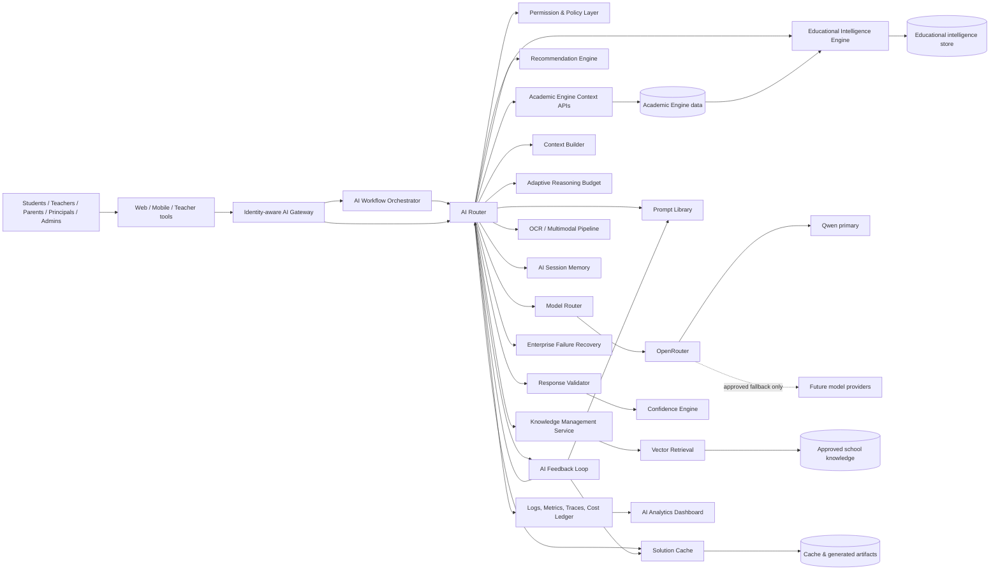

**Control note:** Single-step AI features enter the AI Router directly via the Gateway. Multi-step pipelines (for example question-paper generation chains and image-doubt chains) enter the AI Workflow Orchestrator, which coordinates ordered Router invocations, checkpoints, and recovery without bypassing Router policy.

### 3.2 Control-plane and data-plane separation

The system is deliberately split into two planes.

| Plane | Responsibility | Must not do |
|---|---|---|
| Control plane | Routing policies, capability catalog, workflow definitions, model configurations, prompt versions, Adaptive Reasoning Budget tiers, KMS approval rules, EIE algorithm versions, budget rules, schema versions, retention, school feature flags, Benchmark Suite thresholds, Prompt Evaluation promotion state | Serve raw student records or let a model alter policy |
| Data plane | Authenticate request, enforce policy, obtain AE/EIE context, retrieve/cache/generate, validate, score confidence, return answer, emit audit/feedback events | Bypass the control plane or make durable policy decisions ad hoc |

All runtime requests use published, signed, versioned control-plane policies. Emergency kill switches may disable a feature, provider, model, or school tenant within minutes.

### 3.3 Hard boundary: the LLM never sees raw database access

The Academic Engine exposes **AI Context APIs**, not database credentials and not unrestricted query capabilities. The Educational Intelligence Engine exposes **Intelligence Context APIs** that return precomputed educational metrics derived from Academic Engine events. Each context API returns a typed, purpose-bound projection, for example:

```text
StudentLearningSnapshot v3
  subject, class, requested date range
  attendance summary
  assessed concepts and mastery bands   <-- from Educational Intelligence
  recent mistake patterns               <-- from Educational Intelligence
  pending homework status
  revision activity summary
  teacher-approved remarks (where authorised)
  provenance and source timestamps
```

The model receives an already-approved projection, never SQL, table names, row identifiers, or a generic data-access tool. The router, Academic Engine, and Educational Intelligence Engine jointly decide what fields are available. Mastery bands, risk scores, and readiness metrics are computed outside the LLM.

---

## 4. Component ownership and responsibilities

| Component | Owns | Does not own |
|---|---|---|
| AI Gateway | Request authentication hand-off, tenant binding, client compatibility, rate limits, request envelope validation | Academic permissions or model selection |
| AI Workflow Orchestrator | Multi-step pipeline definition, step checkpoints, compensation, workflow-scoped state hand-off to Router | Single-request route policy (delegates to Router) |
| AI Router | Route selection, single-request orchestration, policy sequencing, budget gates, response provenance | Raw academic truth, provider-specific application logic, multi-step DAG authorship |
| Permission Layer | Authorisation decision, relationship verification, purpose restrictions, field-level data entitlements | Prompting or academic calculations |
| Academic Engine Integration | System-of-record typed context projections, deterministic answers, source freshness/versioning | Free-form model prompting; proprietary educational scoring algorithms beyond record facts |
| Educational Intelligence Engine | Continuous computation of mastery, risk, velocity, readiness, clusters, trends, recommendation inputs; intelligence APIs and refresh | LLM prompting; mutating ERP records; permission decisions |
| Recommendation Engine | Proactive next-best-action packages for student/teacher/parent/principal from Educational Intelligence | Calculating underlying mastery/risk metrics; provider calls without Router |
| Context Builder | Minimal context assembly from Academic Engine + Educational Intelligence + retrieval + session memory; redaction; salience; token budget; provenance manifest | Authorisation decisions; inventing metrics |
| Solution Cache | Exact and semantic reusable answers/artifacts, version-aware invalidation | Storing unauthorised PII or globalising tenant answers |
| Knowledge Management Service | Knowledge lifecycle: ingestion, versioning, approval, chunking, embed/re-embed, expiry, quality, duplicates | Serving retrieval queries at request time (Vector Retrieval) or student-record truth |
| Vector Retrieval | Filtered similarity search over approved, KM-managed corpora; evidence packs | Content lifecycle governance; permission policy as sole control |
| OCR and Multimodal Pipeline | Image/voice extraction, safety, confidence gating, normalised text/diagram packages for Router | Final tutoring answers; durable unrestricted media archives |
| Prompt Library | Versioned task contracts, output schemas, safety instructions, evaluation cases | Context lookup or provider credentials |
| Prompt Evaluation Framework | Draft→benchmark→shadow→A/B→promotion→rollback lifecycle for prompts | Choosing production models without Model Router / Benchmark Suite gates |
| Benchmark Suite | Curriculum, multilingual, hallucination, math, OCR, teacher generation, parent, analytics, safety suites; provider/prompt upgrade gates | Live request routing |
| AI Session Memory | Workflow-scoped tutoring/paper-gen/analytics/parent-guidance memory; preferences; explicit saves | Unrestricted chat memory; Academic Engine record storage |
| Adaptive Reasoning Budget | Simple/Medium/Complex/Enterprise tier assignment: tokens, latency, model capability class | Overriding Cost Optimizer hard budgets or academic truth |
| Cost Optimizer | Token ceilings, rate-card estimates, quotas, batch rules, degradation rules | Altering academic results |
| Model Router | Internal-capability to provider/model mapping, health, retry/fallback eligibility | Routing data requests around policy |
| Response Validator | Schema, grounding, privacy, safety, classroom-quality checks | Rewriting source facts; final confidence disposition alone |
| Confidence Engine | Per-response confidence score, factor attribution, low-confidence behaviours | Changing Academic Engine facts; silent ungrounded invention |
| AI Feedback Loop | Capture teacher/student/parent signals; drive cache, prompt, routing, and quality improvement pipelines | Direct unsupervised fine-tuning on raw minor chat without governance |
| Enterprise Failure Recovery | Provider/system failure → retry → fallback → queue → recovery → replay → audit → notification | Changing educational conclusions to mask outages |
| Observability / AI Analytics Dashboard | Audits, logs, traces, metrics, cost ledger, evaluations, operational AI dashboards | Long-term raw student content retention by default |
| Future Multi-Agent Architecture (reserved) | Named agent roles and Router extension points for later phases | Immediate production agent swarm; autonomous ERP mutation |

---

## 5. Request contract and taxonomy

### 5.1 Required AI request envelope

Every client sends a request containing the following fields. The AI Gateway constructs immutable identity and tenancy fields from the authenticated session; clients may not supply or override them.

| Field | Meaning |
|---|---|
| `request_id` | Globally unique trace identifier |
| `tenant_id` | School identity, injected from session |
| `actor` | Authenticated user identity, role, class/subject assignments and relationship claims |
| `channel` | Student app, teacher workspace, parent app, principal dashboard, admin console, API |
| `feature_id` | Registered product capability, such as `student.doubt.solve` |
| `intent_hint` | Optional UI-selected intent; never authoritative |
| `input` | Text, voice transcript reference, image reference, or structured form data |
| `target_refs` | Student, class, subject, chapter, assignment, date range, only as authorised references |
| `locale` | Language and curriculum presentation preferences |
| `interaction_mode` | Interactive, streaming, batch, or asynchronous |
| `client_context_version` | For compatibility and traceability |

The gateway rejects requests that lack a registered feature, tenant, authenticated identity, valid target reference, or acceptable payload type.

### 5.2 Taxonomy drives route, policy, context, and cost

Features are registered in a **Capability Catalog**. A free-text request is mapped to a known capability; it never becomes an unrestricted open-ended task.

| Class | Examples | Preferred route | Model policy |
|---|---|---|---|
| A. Deterministic record query | Attendance, homework due, marks, timetable, notifications | Academic Engine | No LLM by default |
| B. Deterministic calculation/insight | Attendance percentage, marks trend, ranking only when policy allows, class aggregates | Academic Engine analytics + Educational Intelligence where applicable | No LLM; optional explanation layer |
| C. Cached explanation | Repeated concept explanation, FAQ, known solution, approved revision card | Solution Cache | No LLM on hit |
| D. Grounded knowledge retrieval | School policy, syllabus concept, teacher-provided notes, curriculum material | Knowledge Management → Vector Retrieval plus response composer | Model only when retrieval alone cannot answer |
| E. Personalised academic intelligence | Mistake analysis, revision plan, learning insight, parent summary, recommended next concept | Educational Intelligence + Academic Engine context plus Qwen | Strict context and mandatory grounding; LLM explains intelligence, does not compute it |
| F. Content generation | Worksheets, assignments, tests, question papers, flashcards, chapter summaries | Workflow Orchestrator + artifact cache then Qwen | Structured output; teacher review where required |
| G. Multimodal academic support | Image doubts, voice doubts | OCR/Multimodal Pipeline then A–F route | Model use gated by extraction confidence |
| H. Proactive recommendation | Next practice, teacher intervention, parent action, principal focus area | Recommendation Engine from Educational Intelligence | Optional short narrative via Router; metrics stay deterministic |
| I. Sensitive/high-impact | Student risk indicators, disciplinary remarks, comparative teacher analytics, private parent matters | Purpose-specific workflow | Human review, redaction, or refusal as configured |
| J. Unsupported or unsafe | Medical, legal, harmful, self-harm, credential requests, cross-student data requests | Safety response/escalation | No academic model call unless approved safe response template requires it |

### 5.3 Examples of deterministic answers

The following must be served directly from the Academic Engine whenever the question maps unambiguously:

- “What is my attendance this month?”
- “Which homework is due tomorrow?”
- “When is my mathematics test?”
- “Show my marks in Science.”
- “How many students in Class 8A have submitted the assignment?”
- “Which classes had low attendance yesterday?”

An LLM may optionally produce a plain-language explanation after the facts have been obtained, but it must not be used to retrieve, calculate, or alter those facts. If the explanation is optional, the UI should default to a concise deterministic card first.

---

## 6. The AI Router

### 6.1 Router mandate

The AI Router is the sole **single-request** orchestration authority for AI requests. Multi-step pipelines are owned by the AI Workflow Orchestrator, which invokes the Router for each step under the same policy regime. For every request (or workflow step), the Router decides, in policy order:

1. Is the request valid, safe, authenticated, feature-registered, and within quota?
2. What capability and request class does it represent?
3. What permissions, relationship checks, and field restrictions apply?
4. Can the Academic Engine answer deterministically?
5. Can the Educational Intelligence Engine answer with a precomputed insight (optionally plus a bounded explanation)?
6. Can a valid exact cache or precomputed artifact answer?
7. Is retrieval from Knowledge Management–approved corpora appropriate?
8. Is a model call justified, within Cost Optimizer and Adaptive Reasoning Budget, and supported for this task?
9. What minimal context, prompt version, model capability, session memory scope, and output contract are needed?
10. Did the response pass Response Validator and Confidence Engine gates, and should it be cached or fed to the Feedback Loop?

The router makes these decisions using deterministic policies and registered capability metadata. It does not ask an LLM to decide whether the LLM should be used. Future reserved agent roles (Tutor, Paper Generator, etc.) must still enter through Gateway → Orchestrator/Router without redesigning this decision order.

### 6.2 Routing tree

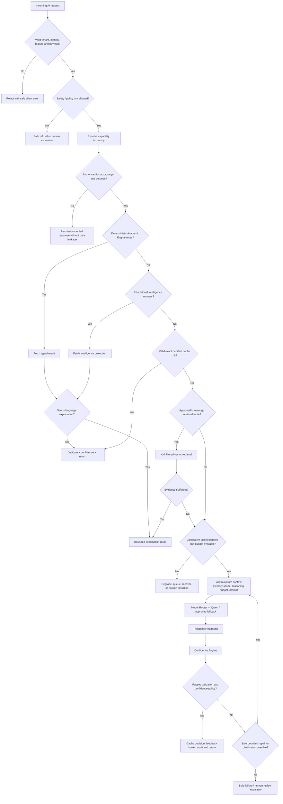

### 6.3 Router state machine

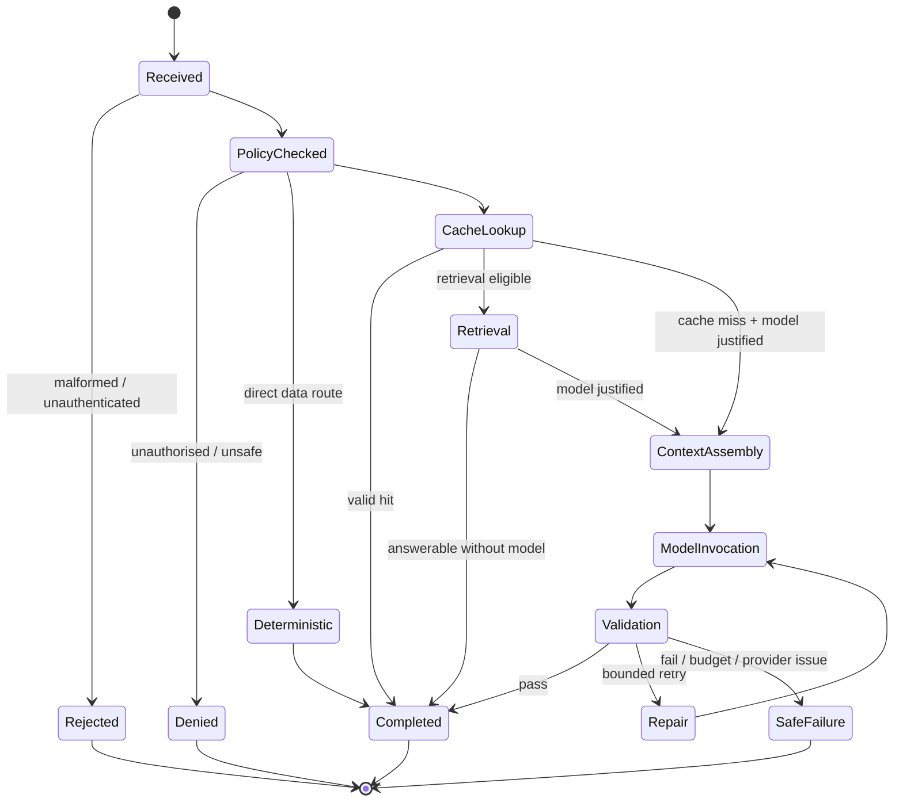

### 6.4 Router decision record

For every request, the router emits an immutable decision record with:

- request, tenant, actor pseudonym, feature, capability class, policy version, and time;
- authorisation result and reason code;
- chosen route and rejected alternatives;
- Academic Engine context schema versions and source freshness;
- cache lookup key class, hit/miss, and invalidation basis;
- retrieval corpus, filters, document IDs, scores, and evidence sufficiency;
- prompt version, model capability, provider, provider model ID, token caps, and actual usage;
- validation result, confidence score/factors, user-visible citations/provenance, cache decision, latency, and cost;
- Adaptive Reasoning Budget tier and workflow/session memory scope when applicable;
- response error class, failure-recovery stage, or escalation outcome when applicable.

The decision record supports support investigations, cost analysis, security audit, model evaluation, and product tuning without retaining more user content than the retention policy allows.

---

## 6A. AI Workflow Orchestrator

### 6A.1 Mandate

The AI Workflow Orchestrator coordinates **multi-step AI pipelines** that cannot be expressed as one-request-one-model-call without losing correctness, cost control, or recoverability. It sits above the AI Router for complex capabilities and **never bypasses** Gateway identity, Permission Layer, Cost Optimizer, Response Validator, or Confidence Engine.

Single-step features continue to call the AI Router directly. The Orchestrator is used when a capability requires ordered stages, intermediate artifacts, human checkpoints, or multimodal preprocessing before a standard route.

### 6A.2 Responsibilities

| Owns | Does not own |
|---|---|
| Pipeline definitions (DAG/state machine) per capability | Academic truth or Educational Intelligence formulas |
| Step sequencing, idempotency keys, checkpoints | Provider API credentials or Model Router internals |
| Passing typed intermediate artifacts between steps | Silent multi-hop agent autonomy without capability registration |
| Workflow-scoped session memory hand-off | Unrestricted chat memory |
| Compensating actions on partial failure (with Failure Recovery) | Mutating attendance, marks, or ERP records |

### 6A.3 Canonical pipelines

**Question paper / teacher generation chain**

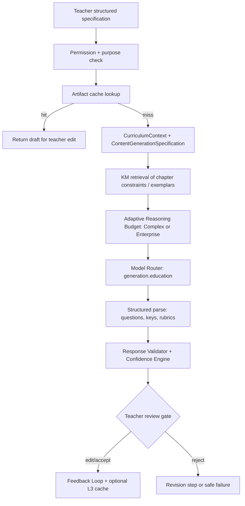

**Student image doubt chain**

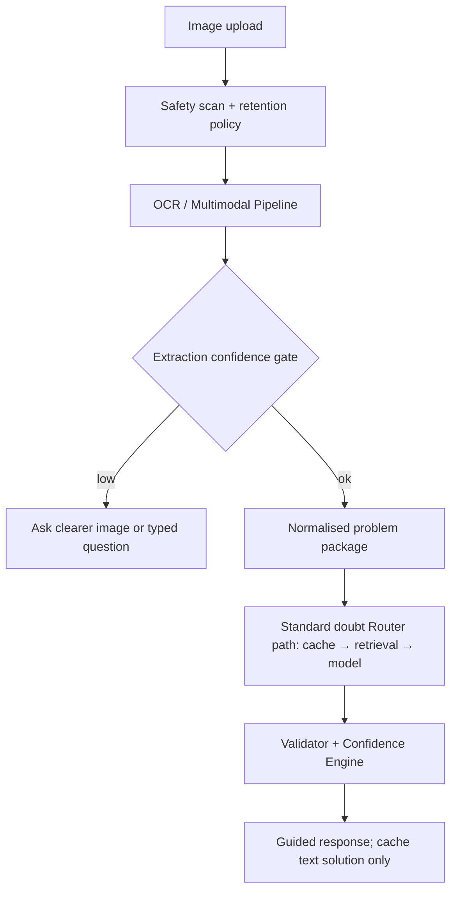

Additional registered pipelines may include scheduled parent-summary packs, principal analytics briefings, revision-plan packs, and future reserved multi-agent workflows—each as an explicit capability DAG, not an open agent loop.

### 6A.4 Workflow contract

Every workflow definition includes:

- `workflow_id`, version, owning capability, and allowed audiences;
- ordered steps with typed inputs/outputs and maximum wall-clock / cost;
- per-step Router feature_id and reasoning budget ceiling;
- checkpoint and human-review requirements;
- failure policy mapping into Enterprise Failure Recovery;
- session memory scope (workflow-scoped unless explicitly saved);
- audit and replay identifiers.

### 6A.5 Relationship to Future Multi-Agent Architecture

Reserved agent roles (Tutor, Paper Generator, Revision Planner, Analytics, Principal Advisor, Parent Coach) are **future consumers** of the Orchestrator. When activated, each agent is a named workflow façade with constrained tools—not a free-roaming planner. Immediate implementation remains single-Router and Orchestrator pipelines; agent swarms are explicitly out of scope for near-term delivery.

---

## 7. Academic Engine integration

### 7.1 Context APIs are products, not convenience wrappers

The Academic Engine team owns verified context projections. Each is versioned, documented, and evaluated for freshness, permission requirements, sensitivity, and token cost.

Initial context API catalog:

| Context projection | Typical consumers | Source data included |
|---|---|---|
| `StudentScheduleSnapshot` | Student, parent | timetable, upcoming due work, next assessments |
| `StudentAttendanceSnapshot` | Student, parent, teacher | authorised period summary, approved reasons where permitted |
| `StudentPerformanceSnapshot` | Student, parent, teacher | marks summary, trends, subject/assessment breakdown |
| `StudentLearningSnapshot` | Student, teacher | concept mastery, mistakes, practice/revision pattern, teacher inputs where permitted |
| `ClassLearningSnapshot` | Teacher, principal | aggregate mastery, common errors, participation and risk bands |
| `TeacherClassworkSnapshot` | Teacher | assignments, submissions, lesson targets, assessment readiness |
| `ParentChildSnapshot` | Parent | only linked child’s progress, attendance and homework insights |
| `SchoolAcademicSnapshot` | Principal, admin | policy-approved aggregate KPIs, trends, subject/class comparisons |
| `CurriculumContext` | Student, teacher | approved syllabus, chapter outcomes, prerequisites, terminology |
| `ContentGenerationSpecification` | Teacher | grade, subject, chapter, learning objective, difficulty, question mix, school constraints |

No projection may silently expand its fields. A schema change needs a version bump, privacy review, prompt compatibility test, and cache invalidation decision.

### 7.2 Context source truth and freshness

Each projection includes:

- `source_as_of`: most recent authoritative source timestamp;
- `generated_at`: snapshot generation timestamp;
- `data_version`: monotonic version or event watermark;
- `completeness`: complete, partial, delayed, or unavailable;
- `provenance`: allowed human-readable source labels;
- `policy_flags`: records excluded because of consent, role, sensitivity, or operational holds.

If data is partial, stale past the capability threshold, or unavailable, the response must state the limitation. A model must not fill the gap with a plausible answer.

### 7.3 Deterministic insight service

The Academic Engine should precompute common numerical and trend insights: attendance rates, assessment trend deltas, assignment completion, concept performance bands, subject/class aggregates, and due-date summaries. Deeper pedagogical intelligence—forgetting curves, revision priority, learning velocity, exam readiness, mistake clusters, confidence scores, intervention metrics—is owned by the **Educational Intelligence Engine** (Section 7A), which consumes Academic Engine events and projections rather than replacing the Academic Engine as system of record.

For example, a student performance response is assembled as:

```text
Academic Engine: “Mathematics average is 74%, up 6 percentage points over the prior three assessments.”
Educational Intelligence: “Algebra concept mastery band = Developing; revision priority = High; recommended next concept = linear equations; exam readiness = Moderate.”
AI layer: “You are improving in Mathematics. Your next best step is to revise algebraic equations before Friday’s practice session.”
```

Facts, dates, calculations, thresholds, and educational scores remain on the left side of this boundary. The LLM explains; it never recalculates.

### 7.4 Boundary with Educational Intelligence Engine

| Concern | Academic Engine | Educational Intelligence Engine |
|---|---|---|
| Primary job | System of record; operational and assessment data integrity | Proprietary educational insight computation |
| Examples | Marks entered, homework submitted, attendance marked | Mastery band, forgetting risk, next concept, class learning pattern |
| Mutation | Authoritative writes via ERP workflows | Read Academic Engine; write intelligence store only |
| LLM access | Via typed Context APIs only | Via typed Intelligence Context APIs only |
| Failure mode | Partial/stale flags; no invented rows | Completeness/freshness flags; no invented mastery |

---

## 7A. Educational Intelligence Engine

> **Strategic position:** The Educational Intelligence Engine is Gurukul’s primary long-term competitive advantage. Providers and models are replaceable. Continuously computed, permission-aware, curriculum-aligned educational intelligence—derived from the school’s real longitudinal record—is not. This engine is **not an LLM** and must never be implemented as prompt-time calculation.

### 7A.1 Mandate

The Educational Intelligence Engine (EIE) transforms raw and structured ERP academic data into **structured educational intelligence products** before any generative model, Context Builder pack for personalisation, or Recommendation Engine package is produced.

It continuously computes and maintains, at minimum:

| Intelligence product | Description | Typical consumers |
|---|---|---|
| Concept mastery | Per-student concept mastery bands from attempts, assessments, practice | Student, teacher, parent (scoped), AI explanation |
| Weak / strong concepts | Ranked strengths and gaps with evidence windows | Student, teacher, revision plans |
| Revision priority | Ordered concepts needing review now | Student, teacher, Recommendation Engine |
| Forgetting curve indicators | Time-decay risk since last successful demonstration | Revision planner, notifications |
| Learning velocity | Rate of mastery change over comparable windows | Teacher, principal aggregates |
| Mistake clusters | Grouped error patterns by concept/misconception | Teacher class analysis, student coaching |
| Subject trends | Subject-level trajectory and volatility | Parent, teacher, principal |
| Attendance risk | Early-warning bands from attendance patterns (non-diagnostic) | Teacher, principal, parent (policy-scoped) |
| Homework consistency | Submission regularity and quality proxies from engine data | Teacher, parent |
| Exam readiness | Readiness band vs upcoming assessments and coverage | Student, teacher, parent |
| Practice efficiency | Gain per practice/battleground unit invested | Student, teacher |
| Battleground performance | Wins/losses/streaks/accuracy/rating-derived learning signals from real battle data | Student Battleground, achievements |
| Improvement trend | Directional progress with confidence of estimate | All authorised roles |
| Recommended next concept | Deterministic next-best learning target | Recommendation Engine, tutoring |
| Student confidence score | Evidence-based engagement/consistency proxy—not personality diagnosis | Teacher intervention (careful language) |
| Parent summary metrics | Parent-safe metric pack for scheduled summaries | Parent AI, scheduled jobs |
| Teacher intervention metrics | Which students/concepts need teacher attention | Teacher workspace |
| Class learning patterns | Aggregate misconceptions, pace, coverage gaps | Teacher, principal |
| School academic health | Policy-approved school/subject/class health indices | Principal, admin |

### 7A.2 Architectural position

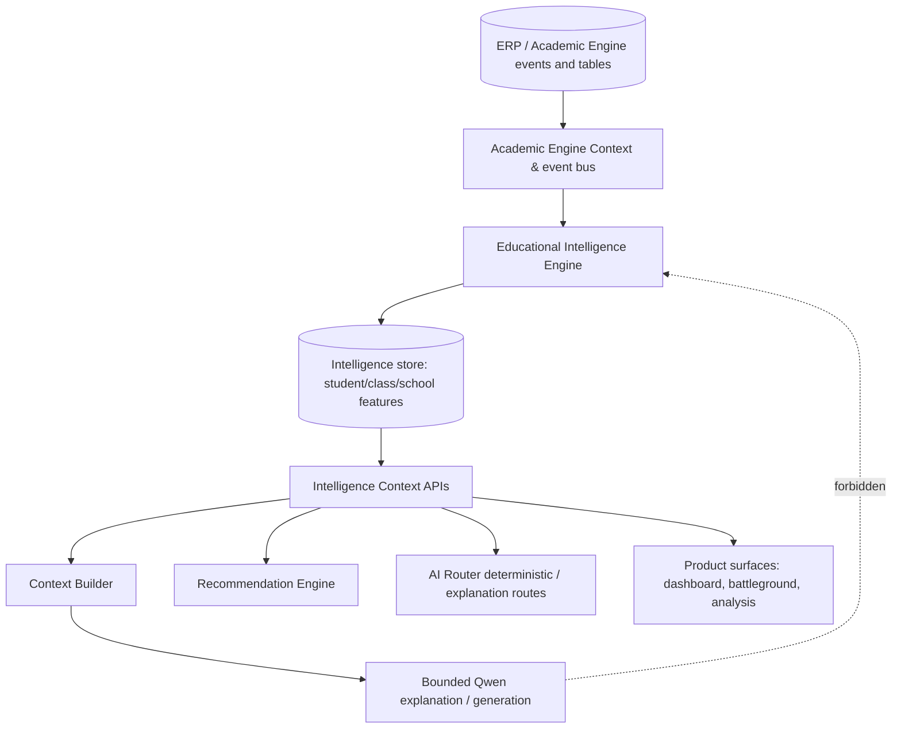

**Hard rule:** LLMs may *explain* EIE outputs and *narrate* recommendations. LLMs must not *compute* mastery, risk, readiness, ranks, or forgetting indicators.

### 7A.3 Computation model

- **Event-driven refresh:** attendance marked, homework submitted/graded, test scored, practice/battleground attempt closed, timetable/assessment schedule change, concept map/curriculum version change.
- **Batch reconciliation:** nightly/period rebuilds to heal missed events and recompute aggregates.
- **Incremental features:** streaming updates for high-churn signals (practice, battles); slower windows for term trends.
- **Versioning:** every intelligence record carries `intelligence_version`, `source_data_version`, `computed_at`, `algorithm_id`, and `completeness`.
- **Explainability:** each score stores factor contributions sufficient for teacher/principal audit without exposing disallowed PII.
- **No demo fabrication:** missing data yields `0` / `null` / empty / `unavailable`—never invented classmates, XP, or mastery.

### 7A.4 Storage

| Store | Contents | Notes |
|---|---|---|
| Student intelligence profile | Mastery map, priorities, velocity, readiness, confidence proxy | Tenant + student keyed; RLS |
| Class intelligence profile | Pattern clusters, intervention queues, coverage | Tenant + class/subject keyed |
| School intelligence profile | Academic health indices, comparative aggregates | Aggregate-only fields by policy |
| Feature ledger | Append-only computation audit for recomputation/debug | Retention per privacy schedule |
| Materialised recommendation inputs | Next concept, revision pack seeds | Consumed by Recommendation Engine |

Caches of intelligence projections in the AI Solution Cache are allowed only with the same version/invalidation discipline as L1 deterministic cache.

### 7A.5 Intelligence Context APIs

Initial catalog (versioned like Academic Engine projections):

| API | Returns |
|---|---|
| `StudentEducationalIntelligence` | Mastery, weak/strong, revision priority, velocity, mistakes, readiness, practice efficiency, battleground learning signals, next concept, confidence proxy |
| `ClassEducationalIntelligence` | Class patterns, common clusters, intervention metrics, pace |
| `ParentEducationalIntelligence` | Parent-safe summary metrics only |
| `SchoolAcademicHealth` | Aggregate health, subject/class trend bands |
| `RecommendationSeed` | Deterministic seeds for Recommendation Engine packages |

All APIs include freshness, completeness, provenance labels, and policy flags. Partial intelligence must be labelled; models must not impute missing scores.

### 7A.6 Integration contracts

| Downstream | Integration |
|---|---|
| Academic Engine | Upstream system of record and event source; EIE never writes ERP facts |
| AI Gateway / Router | Treats EIE as a first-class deterministic/intelligence route before cache/retrieval/model |
| Context Builder | Prefers EIE summaries over raw attempt histories when assembling personalisation packs |
| Recommendation Engine | Consumes `RecommendationSeed` and role-scoped intelligence APIs |
| Solution Cache | May cache explanations of intelligence, not recompute intelligence inside cache writers |
| Prompt Library | Prompts declare required intelligence schemas; forbid asking the model to invent scores |
| AI Analytics Dashboard | Tracks freshness lag, recompute failures, coverage of intelligence products |
| Battleground / Achievements / Analysis UIs | Read real EIE + Academic Engine metrics only—never mock fallbacks |

### 7A.7 Algorithm governance

- Algorithms are versioned (`algorithm_id`), peer-reviewed by Academic Engine + education specialists, and evaluated offline before promotion.
- Threshold changes (e.g., what “High revision priority” means) require the same release discipline as prompt promotion.
- Safeguarding: attendance risk and confidence proxies must use non-stigmatising bands and never imply medical, psychological, or family conclusions.
- Cross-school models that learn from one tenant’s students must not leak into another tenant’s intelligence without explicit network-level product and privacy approval.

### 7A.8 Competitive moat statement

Competitors can rent the same LLM. They cannot easily replicate Gurukul’s closed loop of **ERP truth → Educational Intelligence → permissioned AI explanation → classroom feedback → refreshed intelligence**. Protecting this loop—not chasing model novelty—is the architecture’s strategic priority.

---

## 8. Permission and policy architecture

### 8.1 Authorisation formula

Access is granted only when all conditions are true:

```text
ALLOW = authenticated identity
     AND active school tenant
     AND registered role entitlement
     AND valid relationship or assignment
     AND feature permission
     AND target/data-field permission
     AND declared purpose permitted
     AND consent / sensitivity policy satisfied
     AND rate and budget policy satisfied
```

The permission decision occurs before data retrieval. Response delivery applies a second output policy check, because generated text can reveal data that was not intended for that viewing context.

### 8.2 Baseline role matrix

| Role | May receive | Must never receive by default |
|---|---|---|
| Student | Own attendance, homework, timetable, marks, learning history, tutoring and revision support | Other students’ records, private teacher notes, parent interactions, class rankings unless school policy explicitly permits a limited view |
| Teacher | Assigned students/classes, teaching content, class analyses, teacher-owned feedback | Records outside assignment, parent-private conversations unless explicitly shared, administrative staffing analytics |
| Parent | Linked child/children’s approved summaries, attendance, homework, progress suggestions | Other children, hidden teacher notes, staff/private disciplinary records, raw class analytics |
| Principal | School-level and permitted class/subject analytics, decision support | Personal details beyond a justified operational need; unrestricted private conversations |
| Administrator | Approved operational reports and school-wide insights | Academic narrative details not needed for administrative purpose, counsellor/safeguarding data unless separately authorised |

Schools may configure roles, but they may not weaken cross-tenant isolation, relationship verification, or legal/safeguarding controls.

### 8.3 Purpose binding

The same data may be allowed for one purpose and forbidden for another. For example, a teacher can access a class’s common error patterns to plan a lesson, but cannot use the AI to produce a public list of weak students. A principal can receive aggregated attendance risk indicators but does not automatically receive the private rationale recorded by a teacher.

Every capability has an approved purpose set. The UI feature, not an LLM interpretation of free text, supplies the purpose.

### 8.4 Policy enforcement points

```mermaid
flowchart LR
    I[Authenticated session] --> PE1[Gateway: tenant & identity]
    PE1 --> PE2[Router: feature, purpose & quota]
    PE2 --> PE3[Permission service: role, relationship, fields]
    PE3 --> AE[Academic Engine + Educational Intelligence APIs]
    AE --> PE4[Context Builder: minimisation & redaction]
    PE4 --> LLM[Model, cache, or recommendation package]
    LLM --> PE5[Response Validator + Confidence Engine]
    PE5 --> OUT[Authorised presentation]
```

### 8.5 High-risk policy examples

- Do not infer diagnoses, disabilities, family finances, behavioural labels, or mental-health conclusions from academic data.
- Do not shame, rank, or label a child as “weak,” “lazy,” or “poor.” Use evidence-based, supportive language and task-focused recommendations.
- Do not provide unreviewed exam questions as official school assessments; teachers approve generated high-stakes content before publishing.
- Do not reveal the identity of a child when presenting class, school, teacher, or principal analytics unless the user is authorised and the feature explicitly requires it.
- Do not use student chat content to train external providers or create cross-school memory.

---

## 9. Solution Cache and artifact reuse

### 9.1 Why cache is a first-class academic component

Educational questions repeat. So do concept explanations, textbook-style doubts, teacher worksheet specifications, chapter summaries, flashcards, and school policy questions. Reusing approved, contextual answers improves latency, reduces spend, and provides more consistent quality.

The cache is not a blind text store. It is a policy-controlled knowledge product with scope, freshness, source versions, quality status, and invalidation rules.

### 9.2 Cache layers

| Layer | Example | Key characteristics | Default TTL/invalidation |
|---|---|---|---|
| L0 client presentation | Open timetable card | UI-only; no sensitive content stored outside secure client rules | Session/short-lived |
| L1 deterministic result cache | Attendance summary, homework list | Derived from Academic Engine only | Event/version invalidation; short TTL as backup |
| L2 exact solution cache | Identical approved concept explanation or question solution | Normalised intent/input + curriculum + language + audience + prompt/content version | Long TTL; invalidated by curriculum/prompt/quality change |
| L3 parameterised artifact cache | Worksheet for Grade 7 Science, Chapter 3, 20 questions, medium difficulty | Full structured generation specification; teacher/school scope | Until specification/source/prompt changes |
| L4 semantic candidate index | Similar doubt or FAQ candidate | Retrieval aid only; never returned without eligibility and quality checks | Versioned; rebuild on content change |

### 9.3 Cache key requirements

All cache entries are scoped by at least:

```text
tenant scope + visibility scope + capability + curriculum/subject/grade
+ language + input normalisation + context schema version
+ source data version + prompt version + artifact quality state
```

For personal data, the cache key additionally binds the authorised subject identity and relevant data version. A parent’s personalised summary must never be served to another parent, even when the text appears similar.

### 9.4 Cache eligibility

**Eligible by default**

- Curriculum explanations and solutions verified against approved sources.
- General flashcards, chapter summaries, and similar questions scoped to grade, subject, board, language, and content version.
- Teacher-generated artifacts matching an identical structured specification, within the same school or explicitly shareable curriculum scope.
- Deterministic data result fragments with authoritative version invalidation.

**Not cacheable without explicit policy**

- Personal conversations that reveal sensitive context.
- Parent/teacher narrative summaries containing personal remarks.
- Safety or wellbeing discussions.
- Unvalidated model output.
- Any response including a hidden or unapproved source.

### 9.5 Cache write policy

A response is written only if it is:

1. generated through a registered capability;
2. validated for correctness, safety, formatting, and disclosure;
3. appropriately scoped and redacted;
4. associated with a stable source/version set;
5. marked as reusable by the capability policy.

Negative outcomes, failures, and user-sensitive raw prompts are not stored as reusable solution entries.

---

## 10. Knowledge Management Service

### 10.1 Mandate

The Knowledge Management Service (KMS) owns the **lifecycle** of all content that may enter vector indices or approved knowledge corpora. Vector Retrieval is the request-time search plane; KMS is the control plane for what is allowed to be searchable, at which version, for whom, and for how long.

Without KMS, vector search becomes an ungoverned dumping ground. With KMS, Gurukul can absorb NCERT/curriculum updates, teacher notes, school policies, and exemplar materials under explicit approval and quality gates.

### 10.2 Lifecycle stages

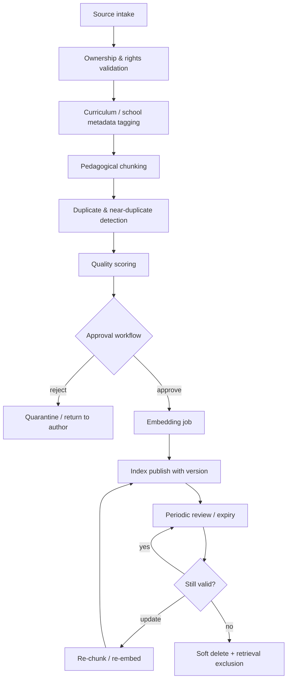

### 10.3 Responsibilities

| Area | Requirements |
|---|---|
| Ingestion | Supported formats; malware scan; PII scan for unexpected student data; source attribution |
| Curriculum versioning | Board, grade, subject, textbook edition, academic year, NCERT/state syllabus version |
| NCERT / syllabus updates | Diff-aware republish; invalidate dependent L2/L3 cache and retrieval evidence |
| Teacher notes | School-scoped; teacher ownership; optional department approval; visibility labels |
| Approval | Dual control for school-wide and network-wide corpora; audit trail |
| Metadata | All fields in §10.6 / Vector metadata; plus quality score, duplicate cluster ID |
| Chunking | Pedagogical section boundaries preferred over naive token windows; preserve equations/figures refs |
| Embeddings | Model capability `embedding.retrieval`; record embedding model version on every chunk |
| Re-embed | Triggered by embedding model change, chunking policy change, or content edit |
| Deletion / expiration | Soft-delete from retrieval immediately; hard-delete per retention; legal hold support |
| Review cadence | Expiry/review dates enforced; stale content excluded from evidence sufficiency |
| Duplicates | Prefer canonical document; suppress near-duplicates in retrieval |
| Quality scoring | Completeness, pedagogical structure, language clarity, safety flags; low-quality never auto-promoted |

### 10.4 Separation from Vector Retrieval and Academic Engine

- **KMS** decides *what may be indexed* and *at what version*.
- **Vector Retrieval** decides *what is similar* among already-approved, filtered chunks.
- **Academic Engine / EIE** remain sources of student truth and educational intelligence—not document stores for personal records.

Student marks, attendance, raw remarks, and operational tables must not be ingested into KMS as a shortcut for personal-record query.

### 10.5 Operational APIs (control plane)

- `RegisterSource`, `SubmitVersion`, `ApproveVersion`, `RejectVersion`
- `PublishIndex`, `ReembedCorpus`, `RetireDocument`, `RestoreDocument`
- `GetCorpusHealth` (coverage, stale %, duplicate %, failed embeds)
- Event hooks to Solution Cache invalidation and Prompt Evaluation when curriculum anchors change

---

## 10A. Vector retrieval architecture

### 10A.1 Purpose and limits

Vector search is for unstructured, **KMS-approved** knowledge: curriculum documents, teacher-approved notes, school policies, exemplar answers, learning resources, and quality-controlled solution explanations. It is not a replacement for structured Academic Engine or Educational Intelligence queries.

Student marks, attendance, raw remarks, and operational tables do not belong in the vector database as a shortcut for querying personal records.

### 10A.2 Retrieval pipeline (request time)

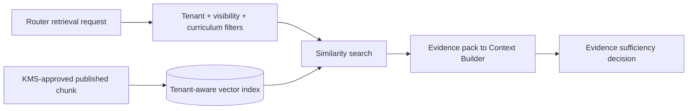

### 10A.3 Required document metadata

Every chunk requires:

- `tenant_scope`: global approved, curriculum network, or school-specific;
- `visibility_scope`: student, teacher, parent, principal, admin, or restricted;
- grade, subject, board/curriculum, chapter, concept, language, and content type;
- owner, source URI/reference, review status, effective date, expiry/review date;
- source and chunk version, embedding model version, copyright/use rights, safety flag, quality score, and indexing timestamp.

Retrieval always applies tenant and visibility filters before semantic similarity. Similarity alone is never an access-control mechanism.

### 10A.4 Retrieval quality policy

For a retrieval-backed answer, the router requires an evidence sufficiency decision. An answer may be produced only if:

- at least one approved source meets relevance threshold;
- sources agree or a conflict policy selects the authoritative one;
- source metadata is compatible with the user’s grade, subject, curriculum, and role;
- citations/provenance can be supplied when the capability requires them;
- KMS status is `published` and not expired/retired.

Otherwise the route escalates to a bounded model call with an explicit uncertainty statement, or it declines if trustworthy grounding is required. The model must not use weak semantic matches as fact.

---

## 11. Context Builder and context policy

### 11.1 Context Builder mandate

The Context Builder converts approved inputs into a compact, typed evidence pack. It is the final data-minimisation boundary before a model or cache compositor sees the request.

It performs:

- schema selection based on capability;
- source freshness and completeness checks for Academic Engine **and** Educational Intelligence projections;
- field allow-listing and PII redaction/pseudonymisation;
- preference for EIE summaries over raw attempt dumps;
- relevance ranking and salience summarisation;
- time-window selection;
- language and curriculum adaptation;
- Adaptive Reasoning Budget–aware token-budget allocation;
- workflow/session memory inclusion when in scope;
- provenance manifest generation (including `algorithm_id` / intelligence versions).

It does not infer permissions, choose a provider, compute mastery/risk, or use a model to discover new records.

### 11.2 Context hierarchy

Context is assembled in this order and stops when the capability’s token budget is reached:

1. System capability contract and safety rules.
2. User request and explicit target metadata.
3. Deterministic Academic Engine facts essential to the answer.
4. Educational Intelligence summaries essential to personalisation (mastery, priority, readiness, clusters).
5. Approved retrieval evidence from KMS-published corpora.
6. Optional workflow-scoped session memory summary, only with consent and relevance.

The builder excludes:

- full history when a current summary is enough;
- unrelated subjects, children, classes, or time periods;
- identifiers when a role label or pseudonym is enough;
- internal notes, policy flags, provider credentials, hidden prompts, and unapproved staff comments;
- raw voice/audio and raw image content after approved extraction unless the task policy explicitly requires it.

### 11.3 Context budgets

Token budgets are capability-level policy values. They are not set by UI developers or models.

| Capability group | Preferred input budget | Preferred output budget | Context design |
|---|---:|---:|---|
| Deterministic explanation | 600 tokens | 250 tokens | Facts plus short explanation instruction |
| Student doubt/concept | 1,200 | 500 | Question, grade/subject, approved evidence, no unnecessary history |
| Personal mistake analysis | 1,500 | 600 | Aggregated patterns, time-bounded attempts, teacher-approved insights |
| Parent progress summary | 1,400 | 500 | Child-only verified trends, no hidden notes |
| Teacher class analysis | 2,000 | 700 | Aggregated class patterns, not full student narratives |
| Teacher content generation | 1,800 | 1,500 | Structured specification, curriculum anchors, output schema |
| Principal/admin analytics explanation | 1,800 | 700 | Aggregated metrics, approved comparisons, source timestamps |

The exact limits may be tuned by evaluation, but increases require a cost and quality review.

### 11.4 Personalisation policy

Personalisation must be educationally useful and explainable. It may use Educational Intelligence mastery bands, recent mistake clusters, revision gaps, recommended next concept, requested language, grade, and learning preferences. It must not infer immutable ability or produce deterministic life outcomes.

Use supportive patterns such as: “Your recent attempts show that fractions with unlike denominators need more practice. Try these two short steps.” Do not use labels such as: “You are weak at mathematics.”

---

## 11A. Recommendation Engine

### 11A.1 Mandate

The Recommendation Engine produces **proactive, role-scoped next-best actions** from Educational Intelligence seeds. It is deterministic-first: packages are assembled from EIE metrics and Academic Engine schedule/assessment facts. An LLM may optionally phrase a short rationale via the AI Router; it must not invent the recommendation itself.

### 11A.2 Recommendation packages

| Audience | Example packages | Primary inputs |
|---|---|---|
| Student | Next concept to practise; 20-minute revision pack; battleground skill focus; homework-first reminder | `RecommendationSeed`, schedule, mastery, forgetting risk |
| Teacher | Intervention queue; class re-teach topic; worksheet specification suggestion; at-risk attendance follow-up list (policy-safe) | Class intelligence, homework consistency, mistake clusters |
| Parent | Home support action for linked child; schedule awareness; celebration of improvement trend | ParentEducationalIntelligence only |
| Principal | Subject/class focus areas; academic health watchlist; examination readiness overview | SchoolAcademicHealth, aggregates |

### 11A.3 Delivery paths

1. **Inline product surfaces** — dashboards, Battleground, Analysis, Practice (no LLM required).
2. **AI explanation route** — user asks “why?” or “help me plan”; Router adds bounded Qwen narrative grounded in the package.
3. **Scheduled jobs** — parent weekly summary seeds; teacher Monday intervention digest; principal weekly health brief (Workflow Orchestrator).

### 11A.4 Safety and quality

- No shaming language; task-focused actions only.
- No cross-child leakage for parents; no unassigned student lists for teachers.
- Recommendations expire when `intelligence_version` or schedule version changes.
- Acceptance, dismiss, and completion signals feed the AI Feedback Loop and may adjust ranking weights—not ERP marks.

---

## 12. Prompt Library

### 12.1 Prompt contracts, not ad hoc strings

Prompts are versioned architecture assets. They live in a Prompt Library, are peer reviewed, tested against evaluation sets, and referenced by immutable version in each request trace.

Every prompt template includes:

- capability identifier and allowed audience;
- task goal and success criteria;
- required/forbidden context schemas;
- source-of-truth statement;
- explicit output schema and maximum length;
- citation/provenance behaviour;
- uncertainty and refusal behaviour;
- tone requirements appropriate to a student, teacher, parent, principal, or admin;
- safety and privacy rules;
- caching eligibility and quality gates.

### 12.2 Prompt layering

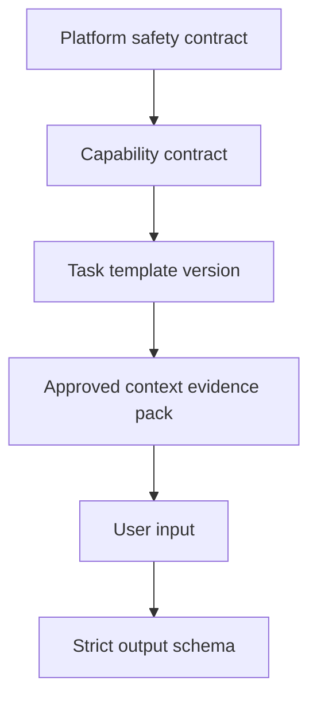

Only the user input is user-controlled. No user content may override platform policy, capability limits, or output contract. All retrieved and context data is treated as evidence, not instruction.

### 12.3 Required answer style by audience

| Audience | Response behaviour |
|---|---|
| Student | Age/grade-appropriate, encouraging, stepwise, no answer dumping when the learning policy requires guidance first |
| Teacher | Actionable, editable, grounded in assignment/class evidence, explicitly distinguish data from recommendation |
| Parent | Clear, respectful, child-specific, practical actions, no educator-private notes or labels |
| Principal | Aggregated and decision-oriented, trends/time periods prominent, caveats and source freshness shown |
| Admin | Operationally useful, permission-scoped, avoids academic narrative not required for administration |

### 12.4 Prompt release process (summary)

Detailed lifecycle is owned by the Prompt Evaluation Framework (§12A). Minimum path:

1. Draft prompt and schema.
2. Review by AI architecture, product owner, and educational reviewer.
3. Run offline Benchmark Suite evaluation.
4. Shadow or limited-school deployment behind a feature flag.
5. A/B compare quality/cost against the current production version.
6. Promote only with documented decision and rollback target.

No prompt may be changed only in production UI code.

---

## 12A. Prompt Evaluation Framework

### 12A.1 Mandate

The Prompt Evaluation Framework governs how prompt versions move from idea to production without silent regression. It is mandatory for every capability that uses a generative model.

### 12A.2 Lifecycle

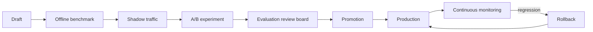

| Stage | Activities | Exit criteria |
|---|---|---|
| Draft | Author template, schema, safety clauses, required EIE/AE context schemas | Peer + education review complete |
| Offline benchmark | Run Benchmark Suite subsets for the capability | Scorecard ≥ baseline; cost ≤ ceiling |
| Shadow | Production traffic mirrored; output not user-visible | Error/safety rates acceptable; no privacy incidents |
| A/B | Split traffic by tenant/feature flag | Statistically and educationally justified win or neutral with cost win |
| Evaluation | Human + automated review; Feedback Loop signals considered | Signed promotion ADR |
| Promotion | Immutable version becomes default; previous marked rollback target | Feature flag default flipped with kill switch |
| Rollback | Instant revert to prior version; incident note | User-visible quality restored |

### 12A.3 Required artifacts per prompt version

- Capability ID, audience, locale support
- Input/output schemas and token budgets
- Required Academic Engine / Educational Intelligence / retrieval schemas
- Offline scorecard link and Benchmark Suite run IDs
- Cost delta vs baseline
- Rollback version ID
- Owner and approval timestamps

### 12A.4 Interaction with Feedback Loop and Benchmark Suite

Teacher edit-distance, student retry/like, validation failures, and hallucination flags can trigger **re-evaluation** of a prompt version but cannot auto-promote a new draft. Promotion always requires Benchmark Suite gates plus human approval for high-stakes capabilities.

---

## 13. AI Memory and AI Session Memory

### 13.1 Memory is narrowly defined

Memory is not a hidden transcript archive. Gurukul supports only explicit, purpose-limited memory layers. **AI Session Memory** extends short-lived workflow memory for tutoring, paper generation, principal analytics, and parent guidance—always workflow-scoped unless the user explicitly saves a preference or draft.

| Memory type | Content | Scope / retention | Use |
|---|---|---|---|
| Turn context | Current request and response state | Request lifetime | Complete one interaction |
| AI Session Memory — tutoring | Approved summary of recent tutoring steps, misconceptions already addressed | Active tutoring workflow / short session window | Avoid repetition; continue hints |
| AI Session Memory — paper generation | Specification, generated sections, teacher edits in progress | Teacher generation workflow or explicit save | Multi-step Orchestrator chain |
| AI Session Memory — principal analytics | Briefing parameters, selected time window, draft narrative state | Principal analytics workflow | Continue investigation without re-fetch sprawl |
| AI Session Memory — parent guidance | Session goals and already-shown actions for linked child | Parent guidance workflow | Continuity within a help session |
| User preference | Language, explanation style, accessibility preference, consented learning preference | User-controlled, durable while active | Improve presentation |
| Academic memory | Source-of-truth learning history in Academic Engine + EIE | Per school retention policy | Always accessed through projections, not copied as chat memory |
| Teacher working memory | Draft generation state / chosen worksheet parameters | Teacher workspace lifetime or explicit save | Continue a content creation workflow |

### 13.2 Session Memory rules

- Default scope is **workflow + actor + tenant**; TTL ends when workflow completes, times out, or user exits.
- Explicit save creates a named draft or preference—not an open-ended chat archive.
- Session Memory is injectable into Context Builder only when the active capability lists it as allowed.
- Orchestrator checkpoints may persist typed intermediate artifacts; they are not free-text “agent brains.”
- Confidence Engine and Validator outcomes may be stored as structured session flags (e.g., “student asked for full solution”).

### 13.3 Memory prohibitions

- Do not store a child’s raw chat history as indefinitely retrievable memory by default.
- Do not infer sensitive attributes from conversation and store them as profiles.
- Do not share memory across tenants, users, siblings, teachers, or roles.
- Do not use provider-side retained conversation threads as Gurukul’s durable memory system.
- Do not allow a model to write durable memory directly. Memory writes use validated, schema-bound application actions with consent and audit.
- Do not implement unrestricted multi-session “chat memory” for students or parents.

### 13.4 Forget and correction controls

Users and authorised school administrators must be able to view, correct, disable, and delete durable preference memory according to role and policy. Academic record correction remains an Academic Engine workflow; intelligence recomputation remains an Educational Intelligence workflow; neither is a chat operation.

---

## 14. Model Router and provider abstraction

### 14.1 Model routing policy

The Model Router maps an internal capability to an approved model configuration. In the initial state, Qwen through OpenRouter is the preferred reasoning route. The rest of Gurukul only sees internal capability labels such as:

```text
reasoning.standard
reasoning.long_form
generation.education
vision.academic_doubt
speech.transcription
embedding.retrieval
```

Application code must not name `qwen`, `openrouter`, provider model IDs, API keys, or provider-specific request fields.

### 14.2 Capability registry

Each model configuration contains:

- internal capability ID and permitted tasks;
- primary provider/model mapping;
- allowed fallback mappings in priority order;
- input/output/context limits;
- expected latency tier;
- current internal price card and maximum request cost;
- supported modalities, languages, structured output, and streaming support;
- data-processing approval level and tenant availability;
- health state, concurrency limit, retry eligibility, and kill switch.

### 14.3 Provider independence rule

OpenRouter is an adapter behind Gurukul’s provider interface. The adapter normalises:

- request schema;
- authentication and secret management;
- streaming events;
- token/usage reporting;
- error classification;
- safety capability metadata;
- model identifiers and fallback selection;
- provider retention/configuration settings where available.

If OpenRouter, Qwen, pricing, or capability availability changes, the Model Router configuration changes after evaluation; product features do not need a rewrite.

### 14.4 Fallback policy

Fallback is not automatic for every failure. The router may fall back only when:

- the capability permits a substitute model;
- the substitute meets data-processing and modality constraints;
- the same context can be safely used;
- projected cost remains under the request and school budget;
- the task is not high-stakes or has a validator/human-review path suited to substitution.

For personal performance insights, official assessments, and sensitive workflows, a provider/model failure generally produces a safe retry, queue, or human-reviewed fallback via Enterprise Failure Recovery—not a silent quality downgrade.

---

## 14A. Adaptive Reasoning Budget

### 14A.1 Mandate

The Adaptive Reasoning Budget assigns each generative (or expensive multimodal) invocation a **complexity tier** that caps tokens, latency expectation, model capability class, and optional deep-reasoning behaviours. It works **with** the Cost Optimizer: the budget tier proposes a ceiling; the Cost Optimizer may further reduce or deny based on school/user quotas.

### 14A.2 Tiers

| Tier | Typical tasks | Input/output posture | Model capability class | Latency posture |
|---|---|---|---|---|
| Simple | Short explanation of known fact; FAQ-style; light parent clarification | Minimal context; short output | `reasoning.standard` (lowest approved) | Interactive, tight |
| Medium | Standard doubt, concept explanation with retrieval, brief parent summary | Standard Context Builder pack | `reasoning.standard` / `generation.education` | Interactive |
| Complex | Mistake analysis, revision plan, class analysis narrative, multi-section worksheet | Richer EIE + evidence; structured long output | `reasoning.long_form` / `generation.education` | Interactive or async |
| Enterprise | Full question paper packs, multi-chapter generation, principal deep briefings, multi-step Orchestrator jobs | Highest approved context; multi-call workflow | `reasoning.long_form` + workflow steps | Async preferred; strict cost reservation |

Exact token numbers are control-plane configuration, not hard-coded in features. Increases require cost + quality review (same bar as Context Builder budget changes).

### 14A.3 Assignment policy

```text
tier = f(capability_default, input_complexity_signals, workflow_step_policy, school_budget_pressure, confidence_of_retrieval/EIE)
```

Signals may include: specification size, number of questions requested, evidence sufficiency, OCR confidence (low confidence → clarify before Complex tier), and whether Educational Intelligence already answers the numeric part (favor Simple explanation tier).

### 14A.4 Behaviours

- Downgrade tier when cache/retrieval/EIE already satisfy the educational need.
- Upgrade only when capability policy allows and Cost Optimizer reservation succeeds.
- Enterprise tier always goes through Workflow Orchestrator with checkpoints.
- Tier, reserved tokens, and actual usage are mandatory Router decision-record fields and AI Analytics Dashboard dimensions.

---

## 15. Cost Optimizer and budget governance

### 15.1 Cost decision order

The Cost Optimizer runs inside the router before model invocation:

1. Reclassify to a deterministic Academic Engine or Educational Intelligence route if possible.
2. Find an eligible exact cache or approved artifact.
3. Assign/confirm Adaptive Reasoning Budget tier.
4. Trim context to the policy budget for that tier.
5. Use an approved lower-cost capability tier if evaluation shows it meets the task’s quality bar.
6. Batch or queue non-interactive work.
7. Enforce per-request and per-feature caps.
8. Enforce user/class/school daily and monthly budgets.
9. Degrade gracefully when capacity is exhausted (Failure Recovery queue where eligible).

### 15.2 Budget hierarchy

| Guardrail | Purpose | Example action on breach |
|---|---|---|
| Request cap | Stops one unexpectedly large input/output | Shorten response or require a new request |
| Feature daily cap | Protects expensive image, batch, or long-form tools | Queue or use an approved template path |
| User daily quota | Prevents abusive or accidental repeated use | Offer cached/deterministic help; reset on schedule |
| Teacher batch quota | Controls worksheet/test generation | Deduplicate, queue, seek approval for exceptional load |
| School daily forecast | Detects budget trend early | Restrict nonessential generation or raise operations alert |
| School monthly hard limit | Guarantees financial ceiling | Preserve deterministic features; place premium generation in controlled mode |

### 15.3 Target allocation for an INR 3,000 school budget

This allocation is a governance starting point, not a claim about fixed provider prices. The active price card is read from the Model Router and verified against current provider billing.

| Budget bucket | Share | Intended work |
|---|---:|---|
| Student tutoring and doubt support | 35% | Model-assisted learning where cache/retrieval cannot answer |
| Teacher creation | 30% | Worksheets, assignments, papers, revision sheets, class analysis |
| Parent summaries | 15% | Scheduled, concise, data-grounded summaries |
| Principal/admin intelligence | 10% | Aggregated insights and decision-support narration |
| Reserve and evaluation | 10% | Provider variance, test traffic, recovery, quality evaluation |

### 15.4 Cost formula and enforcement

For every provider request, record:

```text
estimated_cost = (estimated_input_tokens × active_input_rate)
               + (reserved_output_tokens × active_output_rate)

actual_cost = (actual_input_tokens × billed_input_rate)
            + (actual_output_tokens × billed_output_rate)
```

The reservation uses the maximum expected cost before invocation. The ledger settles to actual cost after usage is returned. If usage data is unavailable, the router retains the reservation and alerts operations; it must not assume the call was free.

### 15.5 Cost-saving product patterns

- Pre-generate and approve chapter summaries, flashcards, common concept explanations, and revision packs.
- Use structured teacher forms for generation, not long natural-language back-and-forth.
- Create a single class-level analysis and derive teacher-facing views rather than making per-student calls for the same question.
- Schedule parent summaries from deterministic snapshots; do not generate one on every app opening.
- Use OCR/transcription once, cache its extraction with access controls, then route as text.
- Stream output but stop generation once the structured response is complete.
- Add “show more” for lengthy explanations rather than generating maximum-length answers by default.

---

## 16. Feature workflows

### 16.1 Student: attendance, homework, marks, timetable

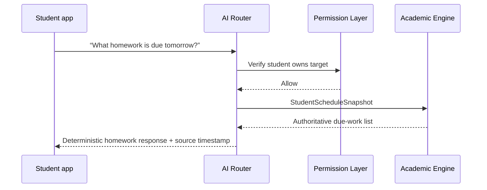

No model call is needed unless the student explicitly asks for an explanation or plan. Even then, the model sees only the approved due-work snapshot and must not invent tasks.

### 16.2 Student: doubt solving

```mermaid
sequenceDiagram
    participant S as Student app
    participant R as AI Router
    participant A as Academic Engine
    participant C as Solution Cache
    participant V as Vector Search
    participant M as Qwen route
    participant X as Validator
    S->>R: Doubt + grade/subject/chapter
    R->>A: CurriculumContext
    R->>C: Exact solution lookup
    alt verified cache hit
        C-->>R: Approved solution
        R-->>S: Guided explanation
    else cache miss
        R->>V: Retrieve approved curriculum evidence
        V-->>R: Evidence pack
        R->>M: Bounded tutoring prompt + evidence
        M-->>X: Draft response
        X-->>R: Validated guided solution
        R-->>S: Stepwise response; cache if eligible
    end
```

The tutoring contract should prefer diagnosis and hints before final answers when the educational policy says so. The student can request the full worked solution; that transition is explicit and recorded for product analytics, not treated as a failure.

### 16.3 Student: image doubt

Handled by the OCR and Multimodal Processing Pipeline (§16A) under Workflow Orchestrator. Summary:

1. Validate upload type, size, malware safety, and privacy policy.
2. Store the original securely with short retention; issue an internal reference only.
3. Run approved OCR/vision extraction, returning text, diagram description, confidence, and detected subject cues.
4. If extraction confidence is low, ask the student for a clearer image or typed question; do not guess from an unreadable worksheet.
5. Route the extracted problem through the standard doubt-solving pipeline.
6. Never place student identity, unrelated worksheet pages, or raw image content into cache keys.

### 16.4 Student: voice doubt

Handled by the OCR and Multimodal Processing Pipeline (§16A). Summary:

1. Capture consent and supported language selection.
2. Transcribe through the speech capability; retain audio only for the configured minimal period.
3. Show the transcript or allow quick correction before expensive reasoning when appropriate.
4. Route the corrected transcript through the standard capability taxonomy.
5. Cache only the appropriately scoped textual solution, not raw audio, unless explicit policy permits otherwise.

### 16.5 Student: mistake analysis and revision plan

The Educational Intelligence Engine (fed by Academic Engine attempts) calculates the evidence: concept-level error clusters, recency, attempt count, correct-after-review rate, revision gaps, and recommended next concept. Qwen converts this into an encouraging, finite plan.

The output must include:

- two to four priority concepts, not an overwhelming list;
- a time-bounded revision sequence;
- a specific practice recommendation;
- strengths that should be maintained;
- an explicit statement that it is a learning recommendation, not a judgement of ability.

It must not infer causes such as lack of effort, family support, intelligence, or medical conditions.

### 16.6 Teacher: content generation

Teacher generation starts from a structured specification, not a blank chat prompt.

| Input | Required examples |
|---|---|
| Curriculum | board, grade, subject, chapter, learning outcomes |
| Artifact | worksheet, homework, assignment, test, paper, revision sheet, flashcards |
| Pedagogy | difficulty mix, question types, cognitive levels, marks, duration, language |
| Constraints | number of questions, formatting, exclusions, school template, answer key requirement |
| Audience | class/section and accessibility needs |

The router checks an artifact cache before generation. Generation output is structured into questions, answers, rubrics, instructions, metadata, and provenance. Official publication requires teacher review and, where configured, school examination workflow approval.

### 16.7 Teacher: student and class analysis

For student analysis, the teacher receives assigned student data only. For class analysis, the Academic Engine precomputes aggregates and common misconception patterns. The model can explain patterns and suggest lesson interventions but cannot fabricate student evidence or make disciplinary recommendations.

### 16.8 Parent: child summary and improvement suggestions

Parent responses use a child-only projection and a parent-safe prompt. They show verified facts, recent trends, and practical home support ideas. Private teacher notes, disciplinary discussions, other children, and unverified causes are excluded.

For scheduled summaries, generate from a fixed reporting snapshot and cache per child/reporting period. The portal should display the source period and generation date.

### 16.9 Principal and admin: decision support

Principal and admin capabilities operate on aggregated, permission-scoped School Academic Snapshots and `SchoolAcademicHealth` intelligence. They can identify trend areas such as “Class 9 mathematics has lower mastery in linear equations than its prior term baseline.” They must distinguish observation, possible contributing factors, and recommended investigation. They must not turn correlations into claims about teacher performance without approved governance and human review.

---

## 16A. OCR and Multimodal Processing Pipeline

### 16A.1 Mandate

The Multimodal Pipeline converts images (and future voice notes) into **normalised, safety-checked academic input packages** before any tutoring or generation route runs. It is a first-class platform component, not an ad hoc call inside feature code.

### 16A.2 Image doubt pipeline (full)

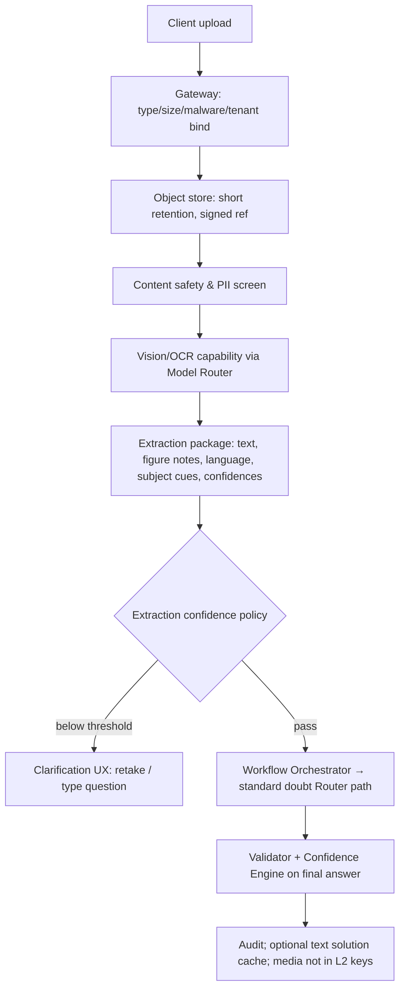

### 16A.3 Extraction package contract

```text
MultimodalExtraction v1
  media_ref, media_type, sha256
  ocr_text, normalised_question_text
  diagram_description (structured, optional)
  detected_language, subject_hints, grade_hints
  extraction_confidence (0-1)
  safety_flags, pii_flags
  provider_capability_id, model_config_id
  processed_at
```

### 16A.4 Voice note pipeline (near-term extension)

1. Consent + language selection.
2. STT via `speech.transcription` capability.
3. Transcript correction UX when confidence low or code-mixing detected.
4. Route as text through taxonomy; retain audio minimally.
5. Future: emotion/prosody must **not** be used for academic judgement or discipline.

### 16A.5 Cost and reliability controls

- Extract once; cache extraction package with access controls and media-version key.
- Adaptive Reasoning Budget: extraction failures trigger clarification (Simple path), not Enterprise guessing.
- Provider failures follow Enterprise Failure Recovery; do not invent problem text.
- Metrics: OCR success rate, mean extraction confidence, clarification rate, media retention compliance—surfaced on AI Analytics Dashboard.

---

## 17. Response validation and quality gates

### 17.1 Validation is mandatory

No model response is returned directly to a user. The Response Validator evaluates the draft against a capability-specific contract.

| Gate | What it checks | Failure action |
|---|---|---|
| Structural | Valid schema, required fields, length, supported language | Bounded repair or safe failure |
| Grounding | Claims trace to deterministic facts or approved evidence | Remove/repair unsupported claims; fail if material |
| Privacy | No disallowed names, private remarks, cross-user data, secrets | Redact or fail closed |
| Safety | Age appropriateness, harmful content, disallowed inference, respectful tone | Refuse/escalate or repair |
| Educational quality | Correct level, pedagogy, clear steps, no answer hallucination | Repair, route to cache, or human review |
| Policy | Feature-specific rules such as no official paper publishing without review | Hold as draft |
| Cost/length | Within output budget and no excessive verbosity | Trim / regenerate once within cap |

### 17.2 Grounding model

Model output should contain machine-readable claim references wherever a capability includes factual data. The validator maps each factual claim to a source key from the evidence pack. If a claim has no source, it is treated as advice/opinion only if the capability permits it and it is clearly phrased as a suggestion; otherwise it fails.

### 17.3 Validation execution model

Use deterministic checks first: schema validation, field scanning, entitlement checks, citation IDs, dates, numeric consistency, prohibited phrases, and source freshness. Use an additional model-based evaluator only for high-value complex quality checks, only under its own cost budget, and never as the sole safety mechanism.

### 17.4 Human-review gates

Human review is required or configurable for:

- high-stakes question papers and official exams;
- mass parent communications;
- sensitive student interventions;
- published school-wide recommendations;
- teacher-performance narratives;
- any generated content flagged by validation, Confidence Engine low-confidence policy, or user report.

---

## 17A. Confidence Engine

### 17A.1 Mandate

The Confidence Engine produces an **internal confidence score** and factor attribution for every AI response (deterministic, cached, retrieval-grounded, or generative). It runs after or alongside the Response Validator and decides low-confidence behaviours. It does not rewrite Academic Engine or Educational Intelligence facts.

### 17A.2 Score model

```text
confidence ∈ [0,1] = weighted combination of:
  evidence_sufficiency
  source_freshness_and_completeness
  retrieval_agreement
  validator_pass_strength
  extraction_confidence (multimodal)
  prompt/model historical reliability for capability
  numerical_consistency_with_AE_EIE
  schema_completeness
```

Weights are capability-specific control-plane configuration. Deterministic AE/EIE answers typically score high when freshness is good; generative answers without citations score lower when the capability requires grounding.

### 17A.3 Factor record

Every response stores machine-readable factors, for example:

- `grounds_ok`, `freshness_ok`, `retrieval_score_p50`, `ocr_confidence`
- `validator_codes[]`, `repair_attempted`
- `budget_tier`, `model_config_id`
- `uncertainty_disclosed` (boolean)

### 17A.4 Low-confidence behaviours

| Policy action | When | User-visible behaviour |
|---|---|---|
| Clarification | Ambiguous question / low OCR / missing target | Ask a precise follow-up; do not guess |
| Safer narrower answer | Partial evidence | Answer only supported subset; state limits |
| Refuse generative claim | Required grounding missing | Deterministic facts only or polite decline |
| Human review hold | High-stakes + low confidence | Teacher/admin queue; draft not published |
| Uncertainty disclosure | Medium confidence, capability allows | Explicit “based on available data as of…” |
| Escalate to Orchestrator retry | Repairable step failure | Bounded re-run with tighter context |

The Confidence Engine never invents higher confidence by removing caveats. Product UX may show simplified language; internal score remains in the decision record for analytics and Feedback Loop.

### 17A.5 Integration

- Router decision record: mandatory `confidence` + factors.
- AI Analytics Dashboard: confidence histograms, low-confidence rate by feature/school.
- Prompt Evaluation / Benchmark Suite: track calibration (high confidence but user reject / teacher rewrite).
- Recommendation Engine: suppress proactive pushes when underlying intelligence completeness is low.

---

## 18. Reliability, retries, and Enterprise Failure Recovery

### 18.1 Error taxonomy

| Error class | Examples | Router action |
|---|---|---|
| Client validation | Unsupported attachment, malformed request | Return precise safe correction request |
| Authentication/authorisation | Expired session, parent-child relationship absent | Deny without indicating sensitive target existence |
| Source unavailable | Academic Engine / EIE timeout or stale context | Retry boundedly; return “data temporarily unavailable” rather than guess |
| Cache/retrieval | Index unavailable, weak evidence | Continue only if policy permits a grounded model route; otherwise fail safely |
| Provider transient | Timeout, rate limit, network error | Enter Failure Recovery: retry → fallback → queue |
| Provider permanent | Unsupported model/capability, invalid payload | Disable configuration, alert operations, safe failure |
| Validation / confidence | Unsupported factual claim, leakage, unsafe content, low confidence | Bounded repair, clarification, or fail closed |
| Budget | User/school cap exhausted | Deterministic/cached response, queue, or transparent limit message |
| Workflow step failure | Mid-pipeline Orchestrator error | Compensate/checkpoint resume via Failure Recovery |

### 18.2 Retry policy

- Retries are idempotent and keyed by `request_id` plus invocation attempt.
- Do not retry unsafe, unauthorised, malformed, budget-exhausted, or validation-failed requests blindly.
- Provider retries use exponential backoff with jitter and a small capability-specific maximum.
- Do not repeat model generation when the output was already received and only delivery failed; recover the validated result from encrypted short-lived request state.
- Circuit breakers open by provider/model/capability after persistent failure thresholds and route only to approved alternatives.

### 18.3 Enterprise Failure Recovery pipeline

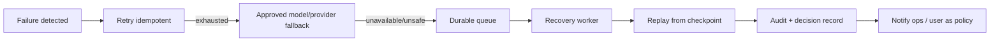

| Stage | Requirements |
|---|---|
| Retry | Idempotent; jitter; respect circuit breaker; no duplicate side effects |
| Fallback | Only Model Router–approved substitutes; same data-processing bar; no silent quality downgrade for high-stakes |
| Queue | Durable, tenant-aware, deduplicated; Adaptive Reasoning Budget reservation retained or re-priced transparently |
| Recovery | Health checks for AE, EIE, KMS/vector, provider; staged re-enable |
| Replay | From Orchestrator checkpoint or encrypted request state; never invent missing academic facts |
| Audit | Full failure class, attempts, fallback IDs, queue latency, final outcome |
| Notification | User: honest status; Ops: pages on SLO breach; School admin: optional for prolonged outage of premium features |

### 18.4 Graceful degradation order

1. Return authoritative deterministic Academic Engine / Educational Intelligence data without narrative.
2. Return validated cache/artifact.
3. Return approved retrieval excerpts with source labels if policy permits.
4. Queue an asynchronous eligible generation task (Failure Recovery queue).
5. Offer a clear limitation and a non-AI workflow.

Never present a degraded answer as if it were the full requested analysis.

---

## 18A. AI Feedback Loop

### 18A.1 Mandate

The AI Feedback Loop captures structured quality signals from teachers, students, parents, and validators, then feeds **controlled improvement** into prompts, cache eligibility, routing thresholds, retrieval quality, and Educational Intelligence algorithm evaluation—without turning Gurukul into an ungoverned fine-tuning pipe on minors’ raw chat.

### 18A.2 Signal catalog

| Signal | Source | Downstream use |
|---|---|---|
| Teacher accept / edit / reject | Teacher generation UX | Edit-distance metrics; artifact cache eligibility; Prompt Evaluation |
| Student like / useful / retry / “show full solution” | Student tutoring UX | Pedagogy tuning; confidence calibration |
| Parent dismiss / helpful | Parent summaries | Tone and length policies |
| Validator / Confidence failures | Platform | Automatic quality alerts; shadow regressions |
| Explicit corrections | Teacher/SME | Golden set candidates for Benchmark Suite |
| Recommendation accept/complete | Recommendation Engine | Ranking weight evaluation |

### 18A.3 Closed-loop process

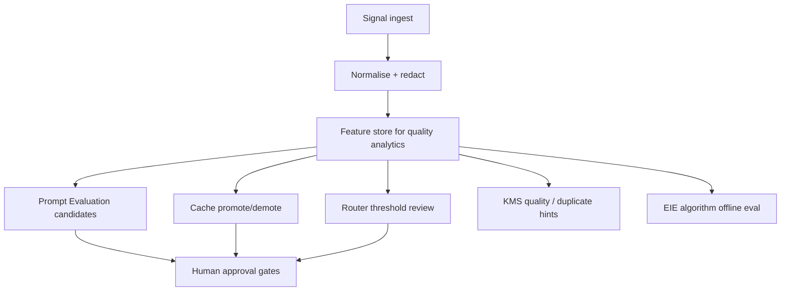

### 18A.4 Hard constraints

- No automatic production prompt promotion from raw feedback alone.
- No provider training on personal student content unless a separate legal/privacy program explicitly allows a de-identified path.
- Feedback retention follows the strictest applicable minor-data class.
- Gaming protection: repeated abuse of “like/dislike” does not unlock budget or permissions.

---

## 19. Security and privacy architecture

### 19.1 Tenant isolation

Every data store, cache entry, vector document, log event, queue message, and provider request is bound to `tenant_id`. Tenant filtering is mandatory at query construction and protected by database-level controls wherever supported. Application-level filters alone are insufficient.

### 19.2 Data protection controls

| Area | Required control |
|---|---|
| In transit | TLS for client, service, database, queue, and provider traffic |
| At rest | Encryption using managed keys; tenant-aware access controls |
| Secrets | Central secret manager, short-lived credentials, rotation, no secrets in prompts/logs/client apps |
| Service access | Workload identity, least-privilege service accounts, network segmentation |
| Attachments | Malware scanning, content-type validation, object-level access, short retention, signed access references |
| Logs | Pseudonymised identity references; content redaction; strict role-based audit access |
| Backups | Encryption, retention, recovery drills, tenant-safe restore procedures |
| Admin access | Just-in-time access, strong MFA, audited break-glass workflow |

### 19.3 Provider data minimisation

Before any OpenRouter/provider invocation:

- remove direct identifiers unless essential and approved;
- use role labels or internal pseudonyms where possible;
- send only the task-relevant time window and field set;
- prevent provider credentials, prompts, internal rules, and unrelated records from entering user-visible text;
- configure provider data use/retention settings consistent with Gurukul’s approved privacy position;
- maintain a current vendor data-processing review before enabling a provider or fallback.

### 19.4 Prompt injection and untrusted content

Student input, teacher-uploaded content, retrieved documents, OCR text, and transcriptions are untrusted data. They cannot instruct the router, alter policy, request secrets, or change the prompt contract.

The system must:

- place untrusted content in data delimiters with an explicit “not instructions” policy;
- forbid tools that let a model issue arbitrary queries or perform mutations;
- scan retrieval content for suspicious instructions and unsafe material;
- use output allow-lists and validator checks for protected actions;
- treat requests to reveal prompts, data, credentials, or other students’ information as security events.

### 19.5 Privacy governance

Gurukul must maintain data retention schedules, consent policy, parent/guardian access controls, deletion/correction workflows, vendor reviews, incident response, and jurisdiction-specific legal review appropriate to the school’s location. This technical design supports those controls; legal obligations and school policy must be approved by qualified counsel and privacy leadership.

---

## 20. Logging, monitoring, AI Analytics Dashboard, and evaluation

### 20.1 Observability architecture

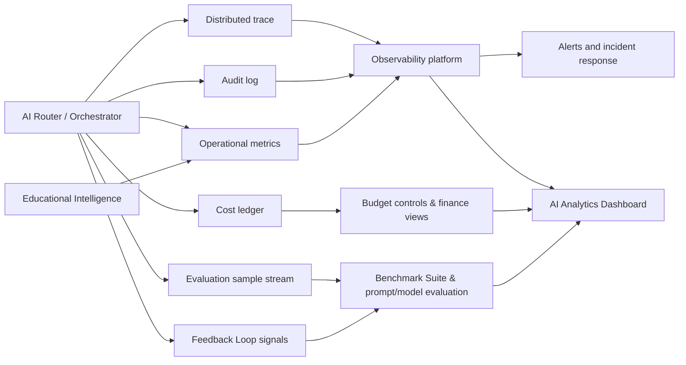

### 20.2 What is logged

Store structured metadata by default, not unrestricted user content. Required fields include request ID, tenant pseudonym, feature, route, workflow ID, policy/prompt/model versions, cache/retrieval/KMS metadata, EIE intelligence versions, Adaptive Reasoning Budget tier, latency, token usage, estimated/actual cost, validation results, confidence score/factors, failure-recovery stage, and error codes.

Raw inputs and outputs require a strict retention class. They may be sampled only for approved quality, safety, support, and incident purposes with redaction and access control. Minors’ content receives the strictest default policy.

### 20.3 AI Analytics Dashboard

The AI Analytics Dashboard is the operational product surface for AI platform health. It must expose at least:

| Domain | Metrics |
|---|---|
| Demand | Requests by school, role, feature, capability class, channel |
| Routing | % deterministic AE, EIE, cache, retrieval, model, safe failure; rejected alternatives |
| Cache | Hit/miss by layer L1–L4; invalidation rates; reuse of teacher artifacts |
| Retrieval / KMS | Evidence sufficiency rate; stale corpus %; embed lag; duplicate suppressions |
| Models | Invocations by internal capability; fallback rate; provider health |
| Latency | Gateway, router decision, AE/EIE, retrieval, OCR, model TTFT/total; p50/p95 |
| Tokens & cost | Input/output tokens; estimated vs actual; cost by school/feature/tier |
| Budget forecast | Daily/monthly burn; 80/90/100% threshold projections |
| OCR / multimodal | Extraction success, confidence distribution, clarification rate |
| Hallucination / validation | Grounding failures, schema failures, privacy redactions, safety refusals |
| Confidence | Score distributions; low-confidence behaviour rates; calibration vs feedback |
| Acceptance | Teacher accept/edit-distance; student useful/retry; parent helpful |
| Prompts | Version share; shadow/A/B status; rollback events |
| Benchmarks | Latest suite scores by capability; gate pass/fail for upgrades |
| Educational Intelligence | Freshness lag, recompute failures, coverage of intelligence products |
| Failure Recovery | Retry/fallback/queue/replay counts; queue age; notification volume |
| Recommendations | Offer/accept/complete/dismiss by audience |

Access is role-restricted (platform ops, AI architecture, finance, school-success as configured). School tenants see only their authorised operational slice, never other schools’ raw content.

### 20.4 Evaluation program and Benchmark Suite

Each capability has a representative, de-identified evaluation set with expected route, sources, response properties, and cost ceiling. Evaluate before release and continuously after release.

#### 20.4.1 Benchmark Suite (mandatory upgrade gate)

No provider, embedding, OCR, or prompt migration is approved solely because it sounds better in a few demonstrations. The Benchmark Suite must include:

| Suite | Purpose |
|---|---|
| Curriculum grounding | Board/grade/subject-aligned factual and pedagogical correctness |
| Multilingual / code-mixed | Indian language and Hinglish/code-mix performance where supported |
| Hallucination | Unsupported academic claims, invented marks/attendance, fake citations |
| Mathematics | Step correctness, symbolic/numeric consistency |
| OCR / multimodal | Extraction quality on handwriting, printed worksheets, diagrams |
| Teacher generation | Spec adherence, difficulty mix, answer key integrity, edit-distance vs gold |
| Parent summary | Tone, privacy, actionable accuracy against parent-safe metrics |
| Analytics / principal | Aggregate fidelity; no unjustified causal/teacher-blame language |
| Safety / privacy | Injection, cross-tenant, disallowed inference, safeguarding language |
| Routing / cost | Expected deflection routes and token/cost ceilings |

Gate rule: candidate ≥ baseline on critical suites, no safety/privacy regression, and cost within approved envelope—then Prompt Evaluation Framework / Model Router staged rollout.

Minimum ongoing scorecards also include:

- factual grounding and numerical consistency with AE/EIE;
- age/grade appropriateness;
- privacy/permission adherence;
- educational helpfulness and non-shaming language;
- teacher acceptance/edit distance for generated content;
- route correctness and cache effectiveness;
- latency and actual cost;
- confidence calibration.

---

## 21. Deployment topology and scalability

### 21.1 Recommended logical deployment

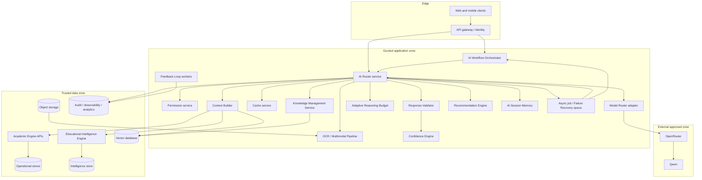

### 21.2 Scaling principles

- Stateless router, orchestrator workers, permission, context, validation, confidence, recommendation, and adapter services scale horizontally.
- Academic Engine and Educational Intelligence APIs are protected with per-tenant and per-capability concurrency controls.
- Cache, vector, intelligence store, queue, and observability stores have tenant-aware capacity and retention policies.
- Asynchronous teacher generation, document generation, large analytics narratives, OCR, transcription, EIE recompute, and Failure Recovery replays use queues with deduplication keys.
- Streaming model responses are proxy-streamed through the router so policy, audit, cancellation, and cost controls remain central.
- Each tenant has logical quotas; noisy schools cannot exhaust shared provider or retrieval capacity.
- KMS re-embed and EIE batch rebuilds are scheduled to avoid peak interactive hours.

### 21.3 Capacity planning

Capacity estimates must measure requests by route, not only total “AI requests.” The model tier is comparatively expensive; deterministic AE/EIE and cache tiers must have enough capacity to absorb peaks such as morning attendance, homework deadlines, examination results, and parent-report periods.

For each school, model forecast includes:

- active users by role;
- requests per user/day by capability;
- cache hit and deterministic/EIE deflection assumptions;
- median and p95 input/output tokens by Adaptive Reasoning Budget tier;
- attachment/OCR/STT volume;
- teacher batch jobs and scheduled reports;
- recommendation job volume;
- current provider price card and fallback multiplier;
- Failure Recovery queue depth assumptions under provider brownouts.

---

## 22. Production readiness requirements

### 22.1 Launch gate checklist

| Area | Required before production school rollout |
|---|---|
| Identity and tenancy | Verified session-to-tenant binding and automated cross-tenant isolation tests |
| Permissions | Role, relationship, field, and purpose policy test suite; deny-by-default controls |
| Academic Engine | Versioned context APIs, freshness flags, deterministic route coverage for record queries |
| Educational Intelligence | Core intelligence products live for pilot grades/subjects; LLM never computes mastery/risk; no demo-data fallbacks |
| Routing | Capability catalog, deterministic/EIE/cache/retrieval/model decision traces; Orchestrator for multi-step only |
| Knowledge Management | Approval workflow, metadata completeness, tenant filters, stale exclusion |
| Prompts | Versioned prompts, schema contracts, Prompt Evaluation Framework path, rollback version |
| Benchmark Suite | Critical suites green vs baseline for launched capabilities |
| Models | Qwen configuration, provider health checks, cost rate card, approved fallback matrix |
| Adaptive Reasoning Budget | Tier configs, reservations, analytics dimensions |
| Confidence Engine | Score emission, low-confidence behaviours tested |
| Multimodal | OCR/STT safety, retention, clarification on low extraction confidence |
| Safety | Validator, injection handling, refusal/escalation scripts, harmful-content test cases |
| Cost | Request/user/school limits, daily forecast, monthly hard stop, AI Analytics cost views |
| Failure Recovery | Retry/fallback/queue/replay/audit/notification drills |
| Feedback Loop | Teacher/student signal ingest with redaction; no auto-promote |
| Observability | End-to-end traces, audits, redacted logs, AI Analytics Dashboard, alert routing, incident runbooks |
| Privacy | Retention schedule, attachment handling, session memory TTL, provider/vendor review, access audit |
| Operations | Feature flags, kill switches, load tests, recovery drills, support workflow |
| Multi-agent | Confirmed **not** enabled in production; reserved extension points documented only |

### 22.2 Required test suites

1. **Routing tests:** every registered intent follows the expected deterministic/EIE/cache/retrieval/model route.
2. **Authorisation tests:** students, parents, teachers, principals, admins, cross-tenant identities, revoked relationships, and malformed target references.
3. **Context minimisation tests:** assert that forbidden fields never leave the Context Builder.
4. **Grounding tests:** source facts, dates, marks, percentages, EIE scores, and citations are preserved precisely; model cannot invent mastery.
5. **Educational Intelligence tests:** refresh triggers, completeness flags, recommendation seeds, empty/zero honest states.
6. **Prompt injection tests:** malicious user input, OCR documents, retrieved content, and teacher-uploaded materials.
7. **Generation / Orchestrator tests:** teacher artifacts satisfy structured specification; checkpoints and replay safe.
8. **Multimodal tests:** unreadable image clarification; voice consent/retention; extraction package contract.
9. **Confidence / validator tests:** low-confidence clarification, human-hold, uncertainty disclosure.
10. **Load and cost tests:** peak periods, cache misses, provider rate limits, large batches, budget exhaustion, tier enforcement.
11. **Failure Recovery tests:** AE/EIE failure, vector outage, provider outage, validation error, partial response, queue delay, replay.
12. **Benchmark Suite gates:** curriculum, multilingual, hallucination, math, OCR, teacher, parent, analytics, safety.
13. **Human usability tests:** students understand tutoring responses; teachers can edit artifacts; parents find summaries respectful and useful.

### 22.3 SLO alerts

Alert on:

- cross-tenant policy violation or suspected leakage immediately;
- provider, model, Academic Engine, Educational Intelligence, or vector error-rate breach;
- EIE freshness lag beyond capability threshold;
- p95 latency and timeout breach;
- validation or low-confidence spike;
- cache hit-rate collapse;
- school forecast exceeding 80%, 90%, and 100% monthly budget thresholds;
- unusual per-user/feature cost spikes;
- Failure Recovery queue age breach;
- prompt injection or secret-exfiltration pattern spike;
- source freshness degradation for critical Academic Engine / EIE projections;
- Benchmark Suite regression on canary traffic.

---

## 23. Implementation roadmap

### Phase 0 - Architecture foundation (weeks 0-4)

**Goal:** Establish the non-bypassable AI perimeter.

- Build AI Gateway, AI Router skeleton, Capability Catalog, Request Envelope, tenant/identity binding, and audit trace IDs.
- Integrate Permission Layer with role, relationship, and purpose checks.
- Define Academic Engine AI Context API standards and implement initial deterministic projections.
- Implement model-provider adapter to OpenRouter/Qwen behind internal capabilities.
- Create Prompt Library, secret management, basic logs, cost ledger, feature flags, and global kill switch.
- Reserve Workflow Orchestrator interfaces and Future Multi-Agent extension points (no agent swarm implementation).

**Exit criteria:** No feature has direct provider access; deterministic attendance/homework/marks/timetable routes work with audited authorisation.

### Phase 1 - High-deflection student and parent intelligence (weeks 5-8)

**Goal:** Deliver useful low-cost assistance before broad generation.

- Build L1 deterministic cache and L2 approved solution cache.
- Stand up Educational Intelligence Engine v1 for mastery, weak/strong concepts, revision priority, and parent summary metrics on pilot subjects.
- Release Student AI: attendance, homework, marks, timetable, concise performance explanations, concept explanations, and controlled doubt solving.
- Release Parent AI: child-only deterministic summaries and scheduled progress narrative pilot.
- Add Context Builder v1 (AE + EIE), Response Validator, Confidence Engine v1, Adaptive Reasoning Budget v1, budget quotas, and AI Analytics Dashboard v1.

**Exit criteria:** Measured deterministic/EIE/cache deflection meets target path; no unauthorised disclosure in policy tests; budget forecast is reliable; LLM never invents mastery scores.

### Phase 2 - Teacher creation, knowledge, and academic intelligence (weeks 9-14)

**Goal:** Add high-value teacher workflows with review gates.

- Deliver Workflow Orchestrator for question-paper / worksheet generation chains.
- Deliver structured question paper, homework, assignment, worksheet, test, revision sheet, flashcard, and chapter-summary generation.
- Build artifact cache, specification hashing, teacher editing/approval, Feedback Loop v1, and asynchronous Failure Recovery queue.
- Expand EIE: mistake clusters, exam readiness, teacher intervention metrics, class learning patterns.
- Launch Recommendation Engine v1 for student next concept and teacher intervention queues.
- Add Knowledge Management Service + vector ingestion for approved curriculum, teacher materials, and school policies.
- Formalise Prompt Evaluation Framework and Benchmark Suite core gates.

**Exit criteria:** Teacher acceptance/edit-distance threshold met; artifact reuse measurable; no official content is auto-published without policy approval; KMS approval required before retrieval.

### Phase 3 - Multimodal and leadership intelligence (weeks 15-20)

**Goal:** Extend safely to voice/image support and aggregate decision support.

- Productionise OCR and Multimodal Processing Pipeline for image doubt; add voice transcription path.
- Expand AI Session Memory for tutoring, paper gen, principal analytics, parent guidance (workflow-scoped).
- Release principal/admin aggregate analytics narratives with `SchoolAcademicHealth` and sensitive-workflow policy.
- Harden Enterprise Failure Recovery (fallback, replay, notifications) and incident drills.
- Expand Benchmark Suite (OCR, parent, analytics, safety) as hard gates for provider changes.

**Exit criteria:** Multimodal failure modes are safe; leadership analytics are aggregate, source-grounded, and reviewed by pilot schools.

### Phase 4 - Multi-school scale and optimisation (continuous)

**Goal:** Serve thousands of schools without losing control.

- Capacity partitioning, tenant quotas, regional deployment strategy, and data retention automation.
- Advanced semantic cache candidates, EIE precomputation optimisation, KMS lifecycle automation, and cost optimisation experiments.
- Add approved multi-model support through the capability registry; compare only through Benchmark Suite + Prompt Evaluation Framework.
- Mature governance: model/prompt change board, privacy reviews, educational quality council, EIE algorithm council, and incident postmortems.
- **Optionally later:** activate reserved Future Multi-Agent façades only after Orchestrator maturity and separate CTO approval—not as a Phase 4 default.

**Exit criteria:** SLOs, safety metrics, and budget targets remain stable under multi-tenant load.

---

## 24. Future multi-model support

### 24.1 Why it is designed now

Qwen via OpenRouter is the primary reasoning configuration. Gurukul must nevertheless be able to adopt better models, add specialist vision/speech/embedding services, or respond to availability and commercial changes without product rewrites or data-policy drift.

### 24.2 Rules for adding a model

A new model/provider may be introduced only after:

1. security and data-processing approval;
2. capability, modality, language, structured output, and latency verification;
3. cost rate-card integration and request cap configuration;
4. evaluation against Gurukul’s Benchmark Suite and baseline Qwen route;
5. prompt compatibility or a separate prompt version via Prompt Evaluation Framework;
6. fallback/kill-switch plan and observability integration;
7. staged deployment by tenant and capability.

### 24.3 No vendor-specific leakage

Provider adapters own message conversions, tool formats, streaming, errors, usage fields, and safety controls. The Prompt Library stores semantic task contracts, not provider-specific hacks. Model-specific prompts are permitted only when documented as an explicit adapter/configuration override.

---

## 24A. Future Multi-Agent Architecture (reserved — not immediate)

### 24A.1 Status

This section **reserves** architecture so Gurukul can later introduce specialised agents without redesigning the Gateway, Router, Permission Layer, Educational Intelligence Engine, or Cost Optimizer. **Do not implement multi-agent swarms, autonomous planners, or free tool-use agents in the near-term roadmap.**

### 24A.2 Reserved agent roles

| Reserved agent | Intended future job | Must still use |
|---|---|---|
| Tutor Agent | Multi-turn guided learning façades | EIE + doubt routes + Session Memory |
| Paper Generator Agent | Long-form assessment pack orchestration | Workflow Orchestrator + teacher review |
| Revision Planner Agent | Multi-week plan assembly | EIE revision priority + schedule |
| Analytics Agent | Deep dive narratives over aggregates | SchoolAcademicHealth + purpose policy |
| Principal Advisor Agent | Decision-support briefings | Aggregate-only intelligence |
| Parent Coach Agent | Home-support coaching sessions | ParentEducationalIntelligence only |

### 24A.3 Non-negotiable constraints when activated later

- Every agent is a **named capability façade** over Orchestrator + Router—not a bypass.
- Agents cannot mutate ERP records, grant permissions, or query raw databases.
- Agents cannot hold unrestricted cross-session chat memory.
- Router decision order (deterministic → EIE → cache → retrieval → model) remains binding per step.
- Activation requires CTO + AI Architecture ADR, Benchmark Suite gates, and school pilot controls.

### 24A.4 Router extensibility (design now, enable later)

- Capability Catalog may later map `agent_role` → workflow_id.
- Decision records already allow `workflow_id` / step IDs.
- Model Router remains provider-agnostic; agents never embed OpenRouter/Qwen calls.
- No change to Academic Engine philosophy or Cost Optimizer sovereignty is permitted for agent rollout.

---

## 25. Governance and decision rights

| Decision | Accountable owner | Required reviewers |
|---|---|---|
| New AI feature/capability | Product owner | AI Architect, Academic Engine, security/privacy |
| New context projection/field | Academic Engine owner | Permission/security, AI Architect |
| New intelligence product / algorithm | Educational Intelligence owner | Academic Engine, education reviewer, AI Architect, privacy |
| Knowledge corpus publish / NCERT update | KMS owner | Education reviewer, school ops (tenant corpora), AI Architect |
| Prompt release | AI product/architecture | Education reviewer, safety reviewer, Benchmark Suite owner |
| New model/provider | CTO / AI Architect | Security/privacy, finance, evaluation/Benchmark owner |
| Adaptive Reasoning Budget policy | AI Architect | Cost/finance, product |
| Recommendation policy | Product + EIE owner | Privacy, education reviewer |
| Permission policy change | Security/privacy owner | Product and school operations |
| Budget policy | Product/finance | AI Architect, operations |
| High-stakes content policy | Academic leadership | AI Architect, school operations |
| Failure Recovery / incident response | Security/operations | CTO and relevant owners |
| Future multi-agent activation | CTO / AI Architect | Security/privacy, Academic Engine, education, finance |

Architecture Decision Records must document every exception to this specification, its expiry date, risk owner, and rollback path.

---

## 26. Developer and implementation-agent guardrails

Future Cursor prompts and developers must comply with these rules:

1. Never call OpenRouter or a model provider from client code or a feature service. Use the AI Gateway → Router (or Workflow Orchestrator → Router).
2. Never give a model SQL access, database credentials, raw table APIs, or mutation tools.
3. Never trust an LLM to decide authorisation, route, caching, budget, source truth, educational scores, or response publication.
4. Never send data to a model before tenant, role, relationship, field, and purpose checks pass.
5. Never treat vector similarity as permission or factual truth; only KMS-published chunks are eligible.
6. Never compute concept mastery, risk, readiness, or rankings inside prompts—use Educational Intelligence Engine APIs.
7. Never cache personal/sensitive output without a capability-specific policy, scope, and invalidation rule.
8. Never expose model/provider errors, hidden prompts, internal identifiers, or credentials to users.
9. Never auto-publish high-stakes educational artifacts without the configured human approval path.
10. Never use unvalidated model output for attendance, marks, timetables, performance calculations, educational intelligence, or school decisions.
11. Never implement unrestricted chat memory or multi-agent autonomy without an ADR activating §24A.
12. Never add a feature without a Capability Catalog entry, context/intelligence contract, prompt version, response schema, reasoning budget, telemetry, Benchmark coverage where generative, and test coverage.
13. Never ship student-facing metrics from mock/demo data; honest empty/zero states are mandatory.

---

## 27. Reference routing matrix

| Feature | First route | Secondary route | Model use | Cache policy | Review / special control |
|---|---|---|---|---|---|
| Attendance query | Academic Engine | None | Optional explanation only | L1 versioned | Student/parent relationship check |
| Homework query | Academic Engine | None | Optional plan only | L1 versioned | Due-date freshness |
| Marks query | Academic Engine | None | Optional explanation only | L1 versioned | No unapproved comparison/ranking |
| Timetable query | Academic Engine | None | No | L1 short-lived | Current schedule version |
| Concept explanation | Solution Cache | KMS → Vector retrieval | Yes on miss/insufficient evidence | L2/L4 | Grade/curriculum/language key |
| Image doubt | OCR/Multimodal Pipeline | Standard doubt flow via Orchestrator | Yes if readable | Solution cached, not raw image | Upload safety + extraction confidence gate |
| Voice doubt | Multimodal STT | Standard doubt flow | Yes if transcript valid | Solution cached, not raw audio | Consent/retention control |
| Explain answer | Solution Cache | Evidence + Qwen | Yes as needed | L2 | Guided pedagogy; Confidence Engine |
| Similar questions | Artifact cache | Qwen | Yes | L3 | Grade/difficulty/learning outcome |
| Mistake analysis | Educational Intelligence | Qwen explanation | Yes | Personal cache usually no | Supportive language; EIE evidence only |
| Revision plan | Educational Intelligence | Qwen | Yes | Short-lived/personal / session memory | Finite, actionable plan |
| Next-concept recommendation | Recommendation Engine (EIE seed) | Optional Qwen rationale | Optional | Package TTL = intelligence version | No shaming; completeness gate |
| Flashcards / summary | Artifact cache | Qwen | Yes | L3 | Curriculum version via KMS |
| Teacher worksheet/test | Artifact cache | Orchestrator + Qwen async | Yes | L3 | Teacher review; Feedback Loop |
| Student/class analysis | EIE + Academic Engine | Qwen explanation | Yes | Restricted, short-lived | Teacher assignment scope |
| Parent summary | Parent EIE + AE snapshot | Qwen scheduled | Yes | Personal reporting period | Child-only / no private notes |
| Principal analytics | SchoolAcademicHealth + AE aggregate | Qwen explanation | Yes | Aggregate cache | Privacy thresholds / no unjustified causal claims |
| Admin reports | Academic Engine aggregate | Qwen explanation | Yes if needed | Aggregate cache | Purpose-bound access |

---

## 28. Final architectural position

Gurukul’s AI is not “Qwen added to an ERP.” It is an academic intelligence operating system built around the **Educational Intelligence Engine**, trusted Academic Engine records, explicit permission, deterministic-first routing, knowledge lifecycle control, workflow orchestration, controlled reuse, minimal context, validated generation, calibrated confidence, measured cost, and continuous feedback—without surrendering privacy or unit economics.

Qwen through OpenRouter is a strong starting engine. Gurukul’s durable moat is proprietary educational intelligence computed before any model call, plus the Router/Orchestrator contract that keeps providers replaceable and schools safe.

Every implementation decision should be tested against one question:

> Does this make Gurukul more trustworthy and educationally useful while strengthening Educational Intelligence and reducing unnecessary model dependence?

If the answer is no, it does not belong in the core AI platform.

---

## Appendix A — Component integration map (quick reference)

| Component | Upstream dependencies | Downstream consumers |
|---|---|---|
| Educational Intelligence Engine | Academic Engine events/APIs | Context Builder, Recommendation Engine, Router, product UIs, Analytics |
| AI Workflow Orchestrator | Gateway, Capability Catalog | Router (per step), Session Memory, Failure Recovery |
| Knowledge Management Service | Curriculum/teacher sources | Vector Retrieval, cache invalidation, Prompt Evaluation hooks |
| OCR / Multimodal Pipeline | Object storage, Model Router | Orchestrator → doubt routes |
| Confidence Engine | Response Validator, evidence/extraction signals | Router return policy, Analytics, human review |
| Adaptive Reasoning Budget | Capability policy, Cost Optimizer | Model Router invocation ceilings |
| Recommendation Engine | EIE seeds | Student/teacher/parent/principal surfaces; optional Router narrative |
| AI Session Memory | Orchestrator / Router capability policy | Context Builder (scoped) |
| AI Feedback Loop | UX signals, validator/confidence | Prompt Evaluation, cache, routing reviews, Benchmark gold sets |
| Prompt Evaluation Framework | Prompt Library, Benchmark Suite | Production prompt versions |
| Benchmark Suite | Golden sets, de-identified fixtures | Model/prompt/provider upgrade gates |
| Enterprise Failure Recovery | Router/Orchestrator/Model Router errors | Queue, replay, audit, notifications |
| AI Analytics Dashboard | Observability, cost ledger, feedback, benchmarks | Ops, architecture, finance, school-success |
| Future Multi-Agent (reserved) | Orchestrator + Router extension points | Not production-active |

**Document maintenance:** Section numbers such as `6A`, `7A`, `10A`, `11A`, `12A`, `14A`, `16A`, `17A`, `18A`, and `24A` are intentional surgical inserts preserving the baseline §1–§28 authority structure while adding enterprise components in their natural architectural positions.

