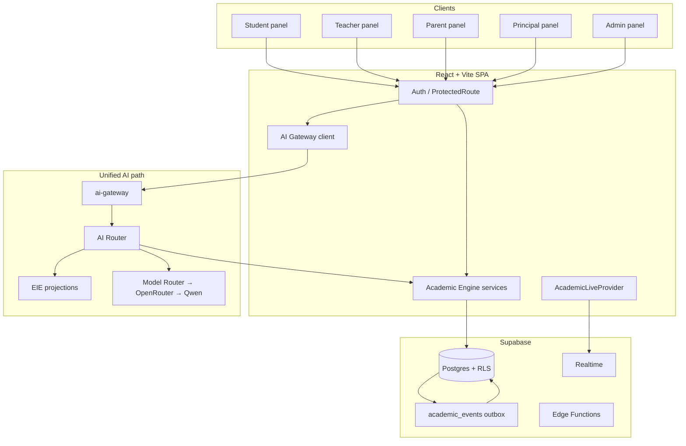

# Gurukul Master App Document

**Document class:** Principal product + systems guide  
**Audience:** Cloud / AI engineers who have never seen Gurukul  
**Repo:** `schoolflow-connect-push` (Vite + React + Supabase)  
**Companion AI SSOT:** [`GURUKUL_MASTER_AI_ARCHITECTURE_SPECIFICATION.md`](./GURUKUL_MASTER_AI_ARCHITECTURE_SPECIFICATION.md)  
**Status:** Accurate to the product **as implemented now** (Battleground recovery, Student Experience M1, AI Phase 0–3, Nova wire). Do not invent features beyond this brief.

---

## 1. What Gurukul is

Gurukul is a **School ERP + Academic Intelligence Platform**.

It is not a generic chatbot wrapped around a school UI. It is a multi-tenant school operating system whose durable advantage is structured academic truth plus derived educational intelligence:

1. **School ERP** — attendance, homework/assignments, tests/DPPs, examinations/marks, timetable, calendar, doubts, announcements, leave, parent–teacher communication, admin provisioning.
2. **Academic Intelligence** — concept mastery bands, recovery/revision surfaces, mistake book, performance analysis, battleground competition, XP/badges, and AI explanations grounded in school records.
3. **Role-native panels** — separate experiences for Student, Teacher, Parent, Principal, and Admin, all sharing one Academic Engine and one school tenant.

### Product vision (north star)

- Every academic number a user sees should come from the **Academic Engine** (system of record) or the **Educational Intelligence Engine** (deterministic computation on that record)—never from a language model and never from invented demo classmates.
- AI (Nova and other capabilities) **explains, personalises presentation, and generates bounded artifacts**. It does **not** invent attendance, marks, mastery, XP, ranks, or classmate names.
- Competition (Battleground), practice, and coaching should feel like a real school product—not a quiz toy bolted on.

---

## 2. Product names and branding

Several names coexist in the codebase. Agents must not “unify” branding without an explicit product decision.

| Name | Role in product | Where you see it |
|------|-----------------|------------------|
| **Gurukul** | Internal product / panel namespace | Folders `src/gurukul*`, CSS roots (`gurukul-student`, `gurukul-teacher`, …), docs titles, AI tutor identity (“Gurukul’s academic tutor”) |
| **Wisdom Campus** | Demo / primary tenant school brand and most common in-app school name | Auth copy (“Wisdom Campus · School portal”), session fallback school name, panel theme headers, seed school row, analytics hero copy |
| **SchoolFlow Connect** | Repo / project name | Repository title, some SQL seed comments; **not** a primary end-user brand in the UI |
| **Nova** | Named student AI tutor persona | AI Coach page, Doubt Portal (“Ask Nova AI first”), Recovery copy, capability `student.nova.chat` |
| **Battleground** | Competitive academic battles product surface | Student Battleground home + live BattleRoom |
| **Vidyalaya** | Legacy marketing label on Landing only | `src/pages/Landing.tsx` — older prototype name; treat as inconsistent branding, not the product SSOT |

**Practical guidance for agents:** Prefer “Gurukul” for product/architecture prose, “Wisdom Campus” when referring to the seeded demo school, and “Nova” for the student-facing AI coach.

---

## 3. Who uses it

| Role | Home route | Goals | Panel location |
|------|------------|-------|----------------|
| **Student** | `/student` | Learn, practice, compete, ask Nova, track homework/tests/attendance, recover weak concepts | `src/gurukul/pages/*` + deep flows in `src/pages/student/*` |
| **Teacher** | `/teacher` | Run classes, mark attendance, handle doubts, communicate, announce, leave | `src/gurukul-teacher/*` |
| **Parent** | `/parent` | Monitor linked children, insights, marks, notices, messages | `src/gurukul-parent/*` |
| **Principal** | `/principal` | School overview, teachers/students, exams, attendance, analytics | `src/gurukul-principal/PrincipalApp.tsx` (+ live academic components) |
| **Admin** | `/admin` | Provision users/classes, school operations, reports, settings, AI analytics | `src/gurukul-admin/*` |

### Auth model (summary)

- Supabase Auth (email/password; Google OAuth hook reserved).
- Central auth: `src/auth/` — prefer `useAuth()`.
- Bootstrap: `get_auth_context()` → profile + role + `schoolId`.
- **One role per account.**
- Public signup: **Student or Parent only**. Staff (teacher/principal/admin) are invited/provisioned.
- Cross-role URL access → `/unauthorized`. Inactive profiles → `/unauthorized`.
- Details: `docs/AUTHENTICATION.md`.

---

## 4. Core philosophy (non-negotiable)

### 4.1 Academic Engine is the System of Record (SoR)

All academic mutations and authoritative reads for attendance, homework, marks, remarks, tests/practice/doubts, profiles, XP/badges/battles go through **`src/academic/` services**. Panels must **not** bypass services to write raw academic tables for product features.

### 4.2 No demo / fake data on mounted product routes

If live data is missing: show `0` / `—` / empty state. **Never** invent demo XP, levels, classmate names (e.g. “Arjun Sharma”), or fake ranks on mounted student (and other product) routes.

Unmounted design-only files may keep fixtures **only** with an explicit `DESIGN-ONLY` header comment. Do not mount them as product truth.

### 4.3 Student Experience Engine extends the Academic Engine

XP, badges, and battle finish flows are part of Academic Engine services / SQL events—not a parallel “gamification fork.” Migration language: *extend Academic Engine; do NOT fork SyncEngine.*

### 4.3a Unified Academic Data Platform = Academic Engine extensions

There is **no second SSOT / parallel SyncEngine / “Nova database.”** The Unified Academic Data Platform workstream means extending the existing Academic Engine: Nova Context Pack (AE + EIE facts into `student.nova.chat`), Practice Intelligence columns on `question_attempts`, and profile mastery sync via `refresh_student_academic_profile` → `metrics.weakTopics` / `strongTopics`.

### 4.4 AI order of operations

**Deterministic-first → EIE → cache / retrieval → model-last.**

The system must never call an LLM merely because one is available. Primary generative model for the unified gateway path: **Qwen 3.7 Flash via OpenRouter** (`qwen/qwen3.7-flash`, overridable by env). Clients must **never** call OpenRouter/Qwen directly.

> **For full AI architecture** (control plane, budgets, EIE, KMS, workflow orchestrator, SLOs, multi-agent reservation, non-goals): see **`GURUKUL_MASTER_AI_ARCHITECTURE_SPECIFICATION.md`**.

### 4.5 Safe failure over fake answers

If OpenRouter credits/billing fail, budgets trip, or generative is disabled: degrade honestly (“AI temporarily unavailable…”). Deterministic Academic Engine / EIE answers still work. **No fabricated AI answers.**

---

## 5. System architecture overview



### Tech stack (high level)

| Layer | Choice |
|-------|--------|
| Frontend | React 18 + TypeScript, Vite, React Router 6, TanStack Query, Tailwind + shadcn/Radix, Recharts, KaTeX |
| Native shell | Capacitor (Android/iOS) + push notifications |
| Backend | Supabase: Auth, Postgres, RLS, Realtime, Edge Functions (Deno) |
| Academic domain | `src/academic/` (entities, repos, services, sync, analytics, AI, EIE) |
| Tests | Vitest + Testing Library |
| Migrations | `supabase/migrations/` (timestamped SQL; user applies via project workflow) |

Project scripts of note: `db:migrate`, `db:types`, `test`, `test:ai-benchmarks`, `functions:deploy-gateway`. The standalone `ai-*` agent functions (battle report, concept report, explain, DPP gen, recovery/revision/learning-pattern/coach agents) exist separately from `ai-gateway` but now route through OpenRouter via `_shared/structuredCompletion.ts`, not Gemini — Gemini was fully removed on 2026-08-08.

---

## 6. Academic Engine pipeline

**Location:** `src/academic/`  
**Reference doc:** `docs/DATABASE.md`

### Phases (conceptual)

| Phase | What it is |
|-------|------------|
| 1 Contracts | `entities.ts`, `ownership.ts`, `events.ts`, `tenant.ts`, validation |
| 2 Repositories | School-scoped DB access; every write takes `RepoContext { schoolId, userId }` |
| 3 Services | Domain APIs panels call (`AttendanceService`, `HomeworkService`, …) |
| 4 Sync | Outbox fan-out from `academic_events` |
| 5 Analytics / AI data / audit | Read services, summaries, audit trail |
| 6 Panel wiring | Live pages call services via `useAcademicContext()` |

### Canonical write pipeline

```text
Service write
  → DB (tenant-scoped)
  → trigger / emit → academic_events
  → process_academic_event
      → refresh student_academic_profiles
      → notifications (student + parents)
      → school_activity_feed
```

**Rule:** No panel should manually recompute dashboards after attendance / marks / homework. Derived state flows through sync.

### Public service surface (`AcademicServices`)

| Service | Owns |
|---------|------|
| `AttendanceService` | Attendance mark / bulk |
| `HomeworkService` / `AssignmentService` | Assign, submit, grade (product name “Assignment” → table `homework`) |
| `MarksService` | Exams + marks publish |
| `RemarksService` | Teacher remarks |
| `AcademicProfileService` | Profile reads / ensure (writes largely sync-owned) |
| `TestService` | Tests / DPPs (product “Test” → table `dpps`) |
| `PracticeService` | Practice sessions |
| `DoubtService` | Doubts |
| `XpService` | XP reads + equip badge (XP mutations owned by battle/practice RPCs) |
| `BadgeService` | Earned badges / equip |
| `BattleExperienceService` | Create/join/finish battles via RPCs; emits experience events |

Also exported: `AnalyticsService`, `AiSummaryService`, `AuditReadService`, work-lifecycle helpers (`WORK_KINDS`, test/exam kinds).

### Product name → physical table aliases

| Product name | Physical table |
|--------------|----------------|
| Assignment | `homework` |
| Assignment submission | `homework_submissions` |
| Test | `dpps` |
| Examination marks | `marks` |
| Section | `classes.section` |

Do **not** create duplicate tables for aliases.

### Multi-tenancy

- Every school is a row in `schools`.
- Tenant rows carry `school_id`.
- Cross-school access throws `TenantViolationError`.
- Seeded demo school name: **Wisdom Campus**.

---

## 7. Student Experience Engine

**Intent:** Gamified academic engagement (XP, badges, battles) without forking the Academic Engine sync model.

| Concern | Implementation |
|---------|----------------|
| XP | Table `student_xp`; reads via `XpService`; mutations via battle/practice RPCs (not free-form client writes) |
| Badges | `student_badges`; awarded in SQL (`_award_badge` → `badge.earned`); client may equip only |
| Battles | `battles`, `battle_participants`, invites; `BattleExperienceService` wraps finish/create RPCs |
| Events | e.g. `battle.finished` → live domains `battle`, `xp`, `achievements`, `profile` |
| Migration note | `20260801200000_student_experience_events.sql` — extend AE, don’t fork SyncEngine |

**UI consumers:** Battleground, Achievements, Leaderboard, Profile hero stats, dashboard strips—must show live zeros/empty when absent, never mock “Level 14 / 1382 XP” style placeholders.

---

## 8. Educational Intelligence Engine (EIE) — brief

EIE is the **deterministic** layer that turns Academic Engine records into educational insight (mastery bands, risk/readiness-style projections, recommendation inputs).

- Client/server projection code under `src/academic/eie/` and edge `_shared/eieProjection.ts`.
- Example capability: `student.eie.mastery_summary` — route class `eie_insight`, model policy `never`.
- Mastery bands (product language): `critical` / `weak` / `developing` / `strong` / `mastered`.
- **LLMs must never recalculate mastery or invent bands.**

Deep EIE design, refresh, and Intelligence Context APIs: see the AI architecture SSOT.

---

## 9. AI stack summary

> **Deep dive:** [`GURUKUL_MASTER_AI_ARCHITECTURE_SPECIFICATION.md`](./GURUKUL_MASTER_AI_ARCHITECTURE_SPECIFICATION.md)

### What exists now (unified path)

| Piece | Path / note |
|-------|-------------|
| Client gateway | `src/academic/ai/gatewayClient.ts` — `invokeAiGateway`, `askAiCoach`, billing helpers |
| Intent → capability | `src/academic/ai/intentMapper.ts` |
| Capability catalog | `src/academic/ai/capabilityCatalog.ts` (mirrored in `supabase/functions/_shared/`) |
| Edge entry | `supabase/functions/ai-gateway/index.ts` — **sole** entry for this Q&A path |
| Router | `_shared/aiRouter.ts` — deterministic → EIE → cache → model-last |
| Model router | `_shared/modelRouter.ts` — OpenRouter → Qwen only; credentials only here |
| Nova prompt seed | `supabase/migrations/20260802190000_ai_nova_chat_prompt.sql` |
| Nova UI | `src/gurukul/pages/AICoach.tsx` (+ Doubt Portal prompts to ask Nova first) |

### Registered capability examples

Deterministic / EIE (no model inventing records):

- `student.attendance.query`, `student.homework.due`, `student.marks.summary`, `student.timetable.today`
- `student.eie.mastery_summary`
- `parent.child.summary`, `parent.child.narrative`
- Teacher paper-planning capabilities and `principal.school.health_brief` (as catalogued)

Generative / tutor:

- `student.nova.chat` — free-form Nova with **Context Pack v1** (AE attendance/homework/marks/profile + EIE mastery facts); validator grounded on evidence; honest degrade when empty
- `student.performance.explain` — optional explain over precomputed facts
- Image/voice doubt capabilities exist in catalog; **live OCR vendor extraction is deferred**

### Operating notes for agents

- OpenRouter **API key and credits** must be configured in the Supabase function environment for generative Nova. Without credits, expect honest billing degradation—not fake chat.
- Budget quotas / reasoning tiers exist (simple → enterprise reserved).
- **Legacy parallel path:** older `supabase/functions/ai-*` agents (battle report, concept report, explain, DPP gen, recovery/revision/learning-pattern/coach) bypass the Gateway's budget/validator/confidence pipeline — they now call OpenRouter directly via `_shared/structuredCompletion.ts` (migrated off Gemini 2026-08-08), same provider as `ai-gateway` but without its governance. New academic Q&A should go through **`ai-gateway`**, not new direct calls from panels.
- Multi-agent product orchestration is **architecturally reserved**, not a shipped multi-agent runtime for users.

---

## 10. Data principles

1. **Live or honest empty** on mounted routes.
2. **No mock merges** from `@/gurukul/data/mock` into live student stats/battles/leaderboard/achievements as fallbacks.
3. Query failures → toast + zeros / empty lists.
4. Achievements unlock from real XP/wins/streak/accuracy/`student_badges` only.
5. Prefer existing `student_xp` columns over speculative new schema unless required.
6. AI provenance copy in product often states sources explicitly (Academic Engine / EIE / deterministic package).
7. Design-only carve-out: `src/gurukul/components/AnalyticsPage.tsx`, `src/gurukul/pages/ConceptMastery.tsx` (fixtures + DESIGN-ONLY headers; not product-mounted).

**Known soft gaps (honest):** some non-academic chrome still has hardcoded display names (e.g. parent sidebar / principal settings identity cards). Academic mocks on principal analytics were removed in favour of live Academic Engine components; announcements/messages may still use local arrays.

---

## 11. Major modules by role

### 11.1 Student (`/student/*`)

Mounted design shell pages (`src/gurukul/pages/` via `StudentDashboard` + `src/gurukul/nav.ts`):

| Route | Page key / title | Purpose |
|-------|------------------|---------|
| `/student` | Dashboard / Home | Hero stats, missions, activity — live or empty |
| `/student/practice` | Practice | Practice hub (+ deep math12 / AI session / DPP attempt routes) |
| `/student/aicoach` | AI Coach (Nova) | Chat with Nova via AI Gateway |
| `/student/analysis` | Analysis | Performance analysis (live charts/services) |
| `/student/recovery` | Recovery | Weak-area recovery (+ deep session routes) |
| `/student/revision` | Revision | Revision plans |
| `/student/mistakes` | Mistake Book | Mistake history |
| `/student/battleground` | Battleground | Canonical competition home (design-approved) |
| `/student/battleground/battle/:id` | BattleRoom | Live play room |
| `/student/battleground/report/:participantId` | Battle report | Post-battle analysis |
| `/student/leaderboard` | Rankings | Class/school ranks from live data |
| `/student/achievements` | Achievements | Badges / milestones |
| `/student/resources` | Resources | Learning resources |
| `/student/doubts` | Doubts | Doubt portal (+ Nova first) |
| `/student/homework` | Homework | Assignments |
| `/student/attendance` | Attendance | Attendance view |
| `/student/profile` | Profile | Student profile / XP surfaces |
| `/student/timetable` | Timetable | Class timetable |
| `/student/calendar` | Calendar | Calendar events |
| `/student/tests` | Tests | Tests / DPPs surface |
| `/student/learning` | Learning | Learning hub |
| `/student/class` | Class | Class hub |

Additional deep/legacy functional routes remain under StudentDashboard (recovery sessions, practice results, DPP attempt/result, chat, notices). Prefer extending live wiring rather than inventing parallel pages.

### 11.2 Teacher (`/teacher/*`)

**Live nav (7 pages):** Dashboard, My Classes (attendance nested under classes), Doubts, Communication, Announcements, Leave, Profile.

Many legacy pathnames (`/teacher/homework`, `/exams`, `/insights`, `/battleground`, `/question-bank`, `/dpp/*`, …) currently **redirect** into those hubs—they are not separate mounted products yet.

**Orphaned implementations** (exist under `src/pages/teacher/` but are **not** routed in `TeacherApp`): DPP editor/list/analytics, ClassInsights, BattleMonitor / TeacherBattleground / BattleTeacherReport. Treat as unfinished product surface, not live features.

Teacher Academic Workspace evolution (work kinds, finalize vs publish, cron) is planned; several items remain pending—see `.cursor/plans/teacher_academic_workspace_ffbf0b62.plan.md`.

### 11.3 Parent (`/parent/*`)

Dashboard, My Children, Academic Insights, Test Results, Announcements, Messages, Notifications, Profile. Some attendance/homework/fees/complaints paths redirect to nearby pages. Live child switching and live academic/attendance components exist; polish gaps remain on identity chrome.

### 11.4 Principal (`/principal/*`)

Dashboard, Analytics, Teachers, Students, Exams, Attendance, Announcements, Messages, Settings—largely in `PrincipalApp.tsx` with live academic rollups from Analytics / Attendance / Academic Profile / AI summary services for school health style views. Announcements/messages may still be local arrays; settings identity card may still be placeholder chrome.

### 11.5 Admin (`/admin/*`)

Students, teachers, parents, classes, announcements, reports, examinations, homework, leave requests, AI analytics, settings—school operations panel.

---

## 12. Battleground (product-critical)

Battleground is a **first-class competitive academic system**, not a disposable quiz widget.

### Canonical UI (do not redesign without ask)

- **Home:** `src/gurukul/pages/Battleground.tsx`
- Surfaces: Hero, Featured Battles, My Battles, Create Challenge (wizard), Join by Code, History, Leaderboard phases.
- Data wiring: `src/gurukul/hooks/useBattlegroundData.ts` and `BattleExperienceService`.
- **Live room:** `src/pages/student/Battleground.tsx` → `BattleRoom` at `/student/battleground/battle/:id`.
- ArenaHub must **not** replace the design home (`Arena` redirects to `/student/battleground`).

### Product behaviours

- Create challenge → shareable **battle code**
- Join by code
- Featured challenges (daily/weekly/NCERT/beat-topper/teacher scoped as implemented)
- History and reports
- Empty question bank: honest message (`NO_BANK_MSG` / `isEmptyQuestionBankError`) — **never fabricate questions**

### Hard agent rule

Preserve layout, terminology (Challenge, Battle, Finish Battle, Challengers), and CSS. **Wire data only.** Spec: `.cursor/agents/battleground-no-redesign.md`.

---

## 13. Key routes map

Top-level (`src/App.tsx`):

| Path | Guard | Entry |
|------|-------|-------|
| `/` | public | Landing or role redirect |
| `/auth`, `/reset-password` | public / recovery | Auth |
| `/unauthorized` | protected | Wrong role / inactive |
| `/admin/*` | `admin` | AdminDashboard |
| `/principal/*` | `principal` | PrincipalDashboard |
| `/teacher/*` | `teacher` | TeacherDashboard |
| `/student/*` | `student` | StudentDashboard |
| `/parent/*` | `parent` | ParentDashboard |

Student path constants: `src/gurukul/nav.ts` (`PAGE_PATH`).  
Teacher path constants: `src/gurukul-teacher/nav.ts`.

---

## 14. Current maturity and known gaps (honest)

| Area | Status |
|------|--------|
| Multi-tenant auth + role panels | Live foundation |
| Academic Engine services + sync | Live; extend rather than bypass |
| Student shell routes | Mounted; data maturity varies by page |
| Battleground design + create/join/featured/history | Recovered / wired toward live RPCs; depends on question bank + migrations applied |
| Student Experience M1 (XP/badges/battle events) | In progress / present in services + migrations |
| AI Gateway + Router + capability catalog + Nova wire | Phase 0–3 style foundation present; generative needs OpenRouter credits |
| EIE mastery projection capability | Present as deterministic route |
| Empty question bank | Real operational gap; UI fails closed with clear message |
| OCR / multimodal live vendor | **Deferred** (stubs / clarify paths; do not invent OCR text) |
| Multi-agent runtime | **Reserved** in architecture; not a shipped user-facing multi-agent product |
| Teacher DPP / insights / battle monitor pages | Built files exist but **not mounted** |
| Teacher scheduled publish / cron | Deferred per workspace plan |
| Legacy standalone edge agents (now OpenRouter-backed, not Gateway-governed) | Still present; consolidation into `ai-gateway` incomplete |
| Landing brand “Vidyalaya” | Inconsistent with Wisdom Campus / Gurukul |
| README | Still Lovable stub — this document + AI SSOT are the real brief |
| Parent/Principal identity chrome | Some hardcoded display names remain |

---

## 15. How to work on the app (agent / engineer rules)

1. **Extend the Academic Engine** — new academic behaviour belongs in services/repos/events/migrations, not ad-hoc panel SQL writes.
2. **No demo data** on mounted product routes — empty honesty over fake polish.
3. **Battleground:** no redesign unless the user explicitly asks; wire data into `src/gurukul/pages/Battleground.tsx`.
4. **AI:** go through `ai-gateway` / `gatewayClient`; never put provider keys in the client; never invent academic facts in prompts or UI.
5. **Migrations:** agents may author SQL under `supabase/migrations/`; **the user applies** migrations (DONE / push workflow). Do not assume remote DB already has your new migration.
6. **Never commit secrets** — no `.env`, API keys, OpenRouter tokens, service role keys.
7. **Do not commit agent-only personal checklists** into the repo.
8. Prefer existing tables (`student_xp`, `homework`, `dpps`, …) and product aliases over parallel schemas.
9. After meaningful repo changes, follow the project’s commit/push conventions as configured by the user.
10. For AI depth, update or obey the AI architecture SSOT; do not silently diverge capability/router policy.

### Useful local docs in-repo

| Doc | Contents |
|-----|----------|
| `docs/AUTHENTICATION.md` | Roles, signup, session, tenancy |
| `docs/DATABASE.md` | Academic Engine phases, aliases, RPCs |
| `docs/DEMO_ACCOUNTS.md` | Seeded Wisdom Campus demo logins (local/dev) |
| `.cursor/agents/battleground-no-redesign.md` | Battleground freeze rules |
| `.cursor/plans/teacher_academic_workspace_ffbf0b62.plan.md` | Teacher workspace plan + pending items |

---

## 16. Glossary

| Term | Meaning |
|------|---------|
| **Academic Engine (AE)** | Canonical domain layer in `src/academic/` — SoR for academic writes/reads |
| **Academic Profile** | `student_academic_profiles` — sync-maintained projection for dashboards/AI context |
| **academic_events** | Outbox table driving sync fan-out |
| **SyncEngine / outbox** | Processors that refresh profiles, notifications, activity feed from events |
| **EIE** | Educational Intelligence Engine — deterministic mastery/risk/insight computation |
| **Mastery bands** | `critical` → `mastered` classifications from EIE/AE concept scores |
| **Student Experience Engine** | XP, badges, battle experience extending AE (not a separate SoR) |
| **Battleground** | Student competitive battles product surface |
| **Battle Code** | Shareable code to join a challenge |
| **Featured Battle** | Open/scoped challenge kinds (daily, weekly, etc.) |
| **Nova** | Student-facing AI tutor persona (`student.nova.chat`) |
| **AI Gateway** | Edge function sole entry for unified AI Q&A |
| **AI Router** | Server orchestrator: deterministic → EIE → cache → model-last |
| **Capability / feature_id** | Registered AI feature contract (roles, route class, model policy) |
| **Route class** | How a capability is answered (`deterministic_record`, `eie_insight`, generative classes, …) |
| **Model policy** | `never` / `optional_explain` / `required_when_budget` |
| **Adaptive Reasoning Budget** | Tiers `simple` / `medium` / `complex` / `enterprise` (enterprise reserved) |
| **KMS** | Knowledge Management Service — approved school knowledge ingestion/retrieval |
| **OpenRouter / Qwen** | Provider + primary model for generative path (`qwen/qwen3.7-flash`) |
| **RepoContext / ServiceContext** | Tenant-scoped `{ schoolId, userId, role?, … }` for engine calls |
| **TenantViolationError** | Cross-school access rejection |
| **Wisdom Campus** | Primary seeded demo school / in-app school brand |
| **Gurukul** | Product/panel system name |
| **SchoolFlow Connect** | Repository / project name |
| **DESIGN-ONLY** | Unmounted fixture UI for layout review — not product truth |
| **DPP** | Daily Practice Paper / test product alias stored in `dpps` |
| **Work kind** | Teacher academic work lifecycle taxonomy (homework/test/exam styles) |

---

## 17. Suggested reading order for a new agent

1. This document (product + systems map).
2. `GURUKUL_MASTER_AI_ARCHITECTURE_SPECIFICATION.md` (AI contract).
3. `docs/DATABASE.md` + `docs/AUTHENTICATION.md`.
4. `src/App.tsx` → role app entry → relevant `nav.ts`.
5. `src/academic/services/index.ts` and the specific service you will touch.
6. For Battleground work: design page + no-redesign agent spec + `BattleExperienceService`.
7. For Nova/AI work: `gatewayClient.ts`, `capabilityCatalog.ts`, `ai-gateway` + `_shared/aiRouter.ts`.

---

## 18. Document control

| Field | Value |
|-------|-------|
| Title | Gurukul Master App Document |
| Companion | Gurukul Master AI Architecture Specification |
| Accuracy claim | Describes the product as implemented in-repo at authoring time; gaps called out explicitly |
| Forbidden | Inventing unbuilt features; embedding secrets; treating DESIGN-ONLY fixtures as live |

When implementation changes material architecture (new SoR tables, new mounted role modules, AI provider consolidation, Battleground redesign approval), update this document in the same change set or immediately after.
